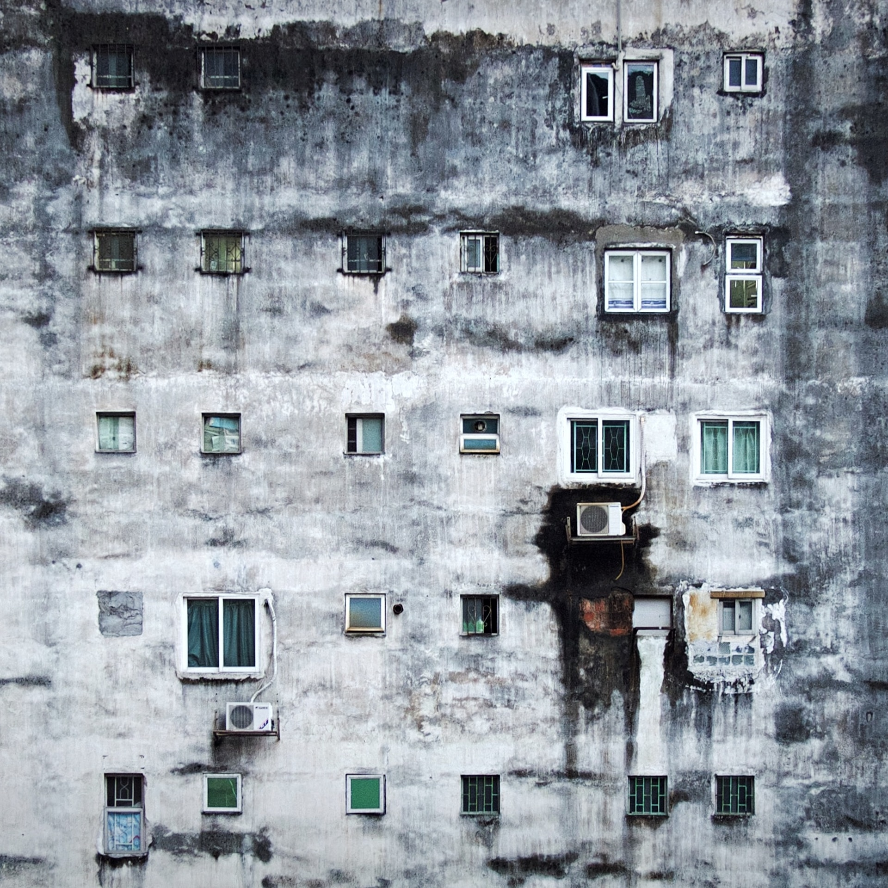

# S2 E19 假如《寄生虫》中的雨夜发生在中国

<figure>
    <figcaption></figcaption>
    <audio
        controls
        src="./audio.mp3">
            Your browser does not support the
            <code>audio</code> element.
    </audio>
</figure>

这期的小声喧哗，我们想和大家聊的是前一阵子在中文网络上很火的《寄生虫》。这是是大家熟悉的韩国导演奉俊昊的作品，主演包括奉导经常合作的演技派演员宋康昊。这部电影于2019年5月21日在戛纳国际电影节主竞赛单元首映，并斩获了金棕榈奖，这也是韩国电影首次拿下金棕榈大奖。

在中国，这部电影也口碑爆表。两位主播@靠谱青年Ina 和@都市丽人阿花  邀请到了好朋友同时也是宾夕法尼亚社会学系博士油飞，来和我们聊一聊这部透析贫富差距、人性等诸多问题的电影，《寄生虫》。这集，我们聊了：

<ul>
<li>为什么电影中的空间感和剧情走向有很大的联系？“向上“和”向下“的隐喻是什么？空间在这部剧中为什么是财富、社会地位和尊严的化身？一个藏在更深处，黑暗处，看不见的群体对于其他两个群体意味着什么？</li>
<li>为什么油飞说《寄生虫》更像是寓言体，为什么电影中的人物是不存在的、且脸谱化？所以也很难对其中角色产生情感投射？为什么说这部电影对于阶级固化的成因没有做任何探讨，只是展现贫困与富有的强烈对比以及由此而来的矛盾冲突本身。</li>
<li>《寄生虫》对于严肃议题的暧昧处理，让它看起来本质是一部很成功的商业故事片，但并没有什么批判意味？</li>
<li>为什么”美国“作为一个宗教版的符号，统摄也瓦解了朴家人的的整个价值体系？电影中的“印第安人”这个意象怎样解读？</li>
<li>最后也是最核心的问题，为什么在中国，人们对《寄生虫》如此有共鸣？中国社会中也有寄生虫现象吗？我们应该如何思索作家张晓晗因《寄生虫》引发的丑闻和“上层人”对于身份和财富的焦虑？</li>
</ul>

