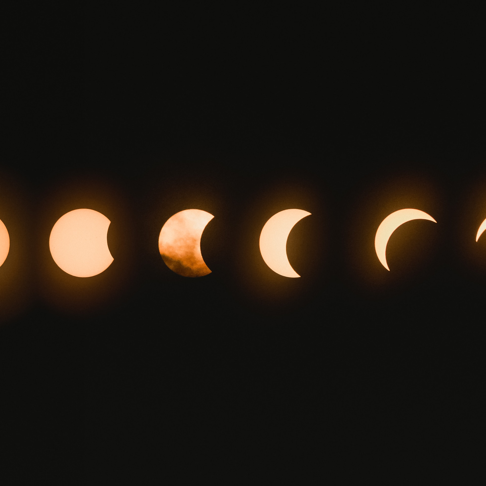

# S2 E20 Rick & Morty：一个相对而言比较积极向上（？）的虚无主义动画片

<figure>
    <figcaption></figcaption>
    <audio
        controls
        src="./audio.mp3">
            Your browser does not support the
            <code>audio</code> element.
    </audio>
</figure>

这个十月比往常虚无荒诞了很多，可能是因为Rick and Morty第四季要开始上映了。

小声喧哗在磨蹭了许多个月之后，终于制作了关于Rick and Morty的节目。 作为当代神剧，Rick and Morty的解读空间比我们想象中还要大，我们试图想多聊几集，但是最后只能在优先的实践中，圈定重点的五集内容，并且邀请了四个嘉宾，分上下集来解读Rick and Morty。

这一集，也就是Rick and Morty（上），我们请了一位物理学家@赵智沉 ，和一位物理哲学家陆沉同来和我们聊聊Rick and Morty里我们最喜欢的三集： A Rickle in Time，Auto Erotic Assimilation和Pickle Riiiiiiiiiiiiiiiiiiiiiiiiick（破音）

这一集我们涉及到了以下内容：

<ul>
<li>两个物理学家试图说服我们不用把Rick &amp; Morty里的科学内容看的太重，并紧接着花了20分钟给@依旧是你们的老杨 和@Izzy牛可可 解释多重宇宙、薛定谔的猫和多世界分叉</li>
<li>我们试图拆解政治哲学中自由观在Auto Erotic Assimilation里的体现，并试图解释Rick and Morty是如何通过不断地提出哲学概念又再五分钟内消解哲学概念来构建剧情</li>
<li>@依旧是你们的老杨 ：啊，虚无主义。陆沉同：这不只是虚无主义。（以上对话重复三次）</li>
<li>Rick所代表的对科学和理性的一味推崇其实是个坑；他自己也没有绕过这个坑</li>
<li>既然所有的蛋糕到最后都只是分子，世界都是一个大脑背叛理性的骗局，我们为何还要做好事、爱身边的人、好好生活？</li>
</ul>

