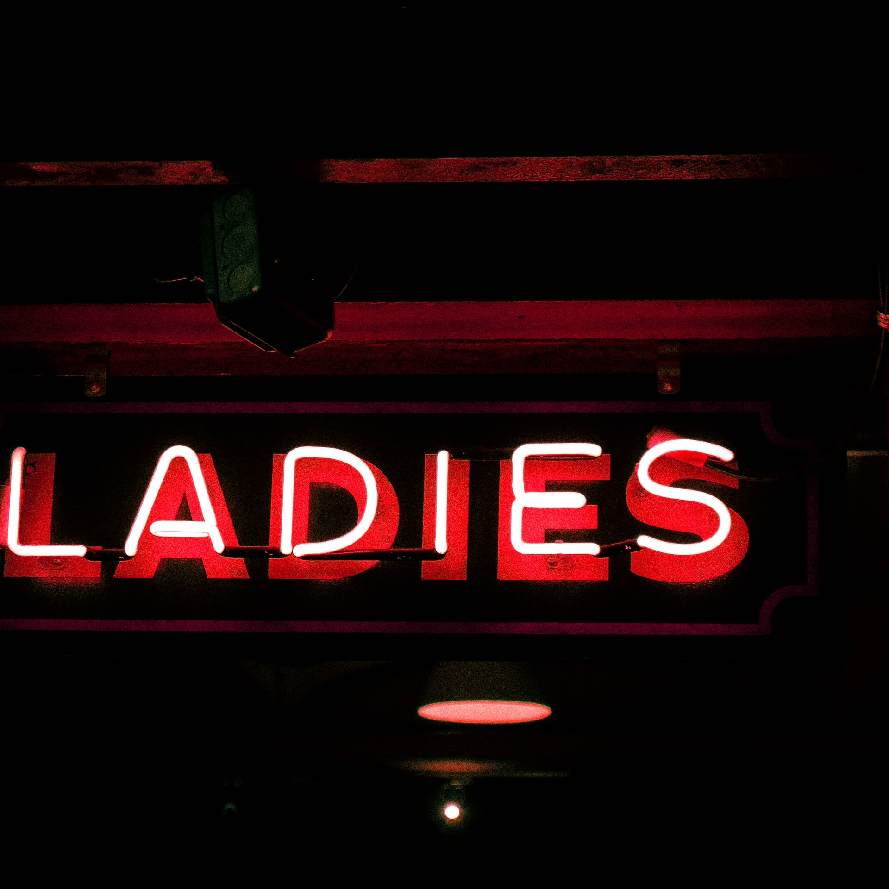

# S2 E18 魔幻与科幻剧集如何演绎女性主义？

<figure>
    <figcaption></figcaption>
    <audio
        controls
        src="./audio.mp3">
            Your browser does not support the
            <code>audio</code> element.
    </audio>
</figure>

小声喧哗和The F Word播客合作。给大家带来了一期关于女权影视作品的播客。The F Word是一档非常棒的关于女权主义的播客，在这里，小声喧哗鞠躬感谢邀请，也希望mur粉们支持The F Word，支持女性视角的播客。

在这集播客里，@Izzy牛可可 推荐了《Russian Dolls/轮回派对》这部作品。而@靠谱青年Ina 给大家推荐《The Expanse/浩瀚苍穹》这部作品。一部是魔幻风格而充满现实主义元素的作品，另一部则是描绘了未来人类剑拔弩张、阴谋遍布的科幻作品。这两者之中，女性角色是如何刻画的？

Izzy和Ina分别描述了她们喜爱这两部剧集的原因，以及分析了这两部迥异的剧集中，对于女性角色的处理方式。

<ul>
<li>为什么说《Russian Dolls/轮回派对》是一部不动声色的女权电视作品？</li>
<li>为什么对“性”的描写非常激进？爱情元素在女主的世界中分量如同吃饭喝水一样为什么这是一个突破？</li>
<li>与众不容的“大女主”Nadia作为主角和其他配角们颠覆了性别叙事吗？</li>
<li>《The Expanse/浩瀚苍穹》是部打破glass ceiling，探索宇宙的科幻神剧。其中，女性角色强而不虚，那些细节让观众觉得舒适？</li>
<li>剧中女性对于权力非常坦诚和向往，这种设定往往颠覆了“女性对权力扭扭捏捏”的刻画。这种设定反射出了那些现实的短板？</li>
</ul>

