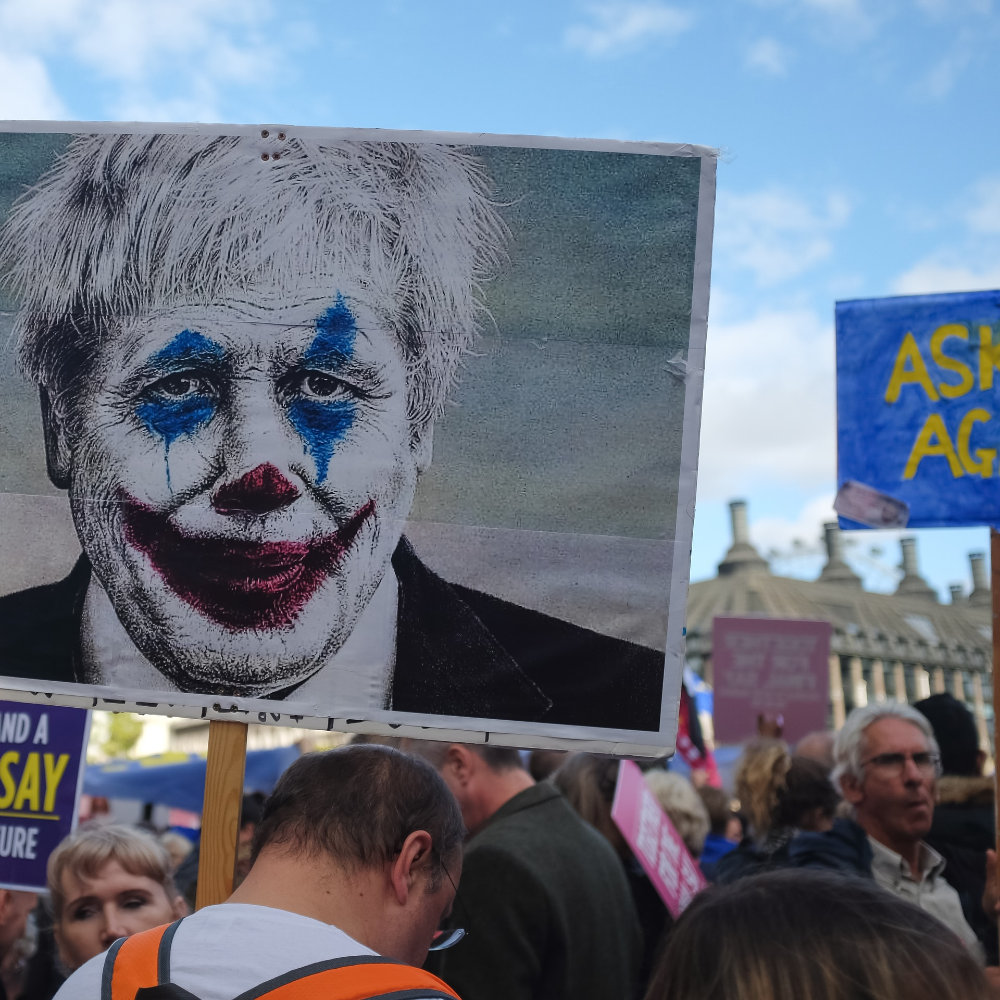

# S2 E22 小丑：孤独的政治哲学

<figure>
    <figcaption></figcaption>
    <audio
        controls
        src="./audio.mp3">
            Your browser does not support the
            <code>audio</code> element.
    </audio>
</figure>

国内的影评人，已经把导演托德菲利普斯执导执导、演技派男主杰昆·菲尼克斯主演的电影Joker捧上了神坛。这期的小声喧哗，我们要把Joker这部电影从神坛上请下来，并且按在地上摩擦。
这期小声喧哗由刁刁和Ina主持，我们还请到了两位老朋友，经常上节目的李尔克，以及经济学博士（aka一位自愿Incel)小钱加入我们。

在Joker上映之后，许多人都对这个角色产生了极大的共情，许多人都说，自己就是小丑。在这部电影中，我们感受到过他感受到的敏感，他强烈的自我（审视）意识，同时，我们都熟悉孤独，因此我们能够想象长期缺少关注、尊重、和亲密接触带来的问题。

我们经历过被社会忽视的那种心中积满暴怒的瞬间。我们中的很多人可能也体验过抑郁症等精神疾病，那种你的大脑和行为完全不在控制范围之内拽着你往下的感觉。导演故意在叙事框架内留出了足够空间和很多个钩子，能够不同的人都能把自己的情绪和意识形态投射到这个故事上：独孤，被冷落，不被赏识，精神疾病，亲情疏离，童年创伤，等等等等，诸如此类。

<ul>
<li>为何说Arthur Fleck之所以成为Joker，依赖了太多不幸的巧合？他的经验是否无法推广到全部的不幸的人？为什么说Joker的立意很高，但是，本可以作为社会批判的抗议和暴乱线更是完全沦为了毫无逻辑的背景板。</li>
<li>为什么电影创作者和庙堂之上的精英们和“Joker”所代表的边缘群体的距离远之又远？</li>
<li>Joker是一个反新自由主义的标志：他童年不幸，患有精神疾病。同时，社会安全网失能。“全都怪社会” 的谩骂依然只破不立，这部电影并不提供一个可代替的宏观叙事/解决方案，为什么这样的结局是可惜的？</li>
<li>为什么说Joker只学习了老马（马丁西科塞斯）的皮毛？而老马所发明出来的“白男群体怒其不幸”的叙事又有哪些短板？</li>
<li>这部电影的那些方面激励了白人至上主义和男权？以及为什么Incel群体对Joker这部电影有着令人不安的热情？这部电影对于男性的身份政治和认同政治以及男性气质，有哪些探讨？</li>
<li>假如Joker是个女性，这部电影会有怎样的观感？</li>
<li>Joker的大获成功，对于DC和漫威的意义如何？</li>
</ul>

感谢大家对我们的支持。如果你愿意文艺复兴式赞助我们，海外用户请使用Patreon：<a href="https://www.patreon.com/loudmurmurs">https://www.patreon.com/loudmurmurs</a> 国内用户请使用爱发电：<a href="https://afdian.net/@loudmurmurs">https://afdian.net/@loudmurmurs</a>

<strong>最稳妥的订阅我们的方式如下：</strong>
如果你是安卓用户，请使用Podcast，overcast，castro或者你喜欢的播客客户端，找到“通过URL添加节目”复制粘贴以下链接：<a href="https://loudmurmursfm.typlog.io/episodes/feed.xml">https://loudmurmursfm.typlog.io/episodes/feed.xml</a>
如果你是苹果用户 ，请打开苹果自带的播客客户端-&gt;资料库-&gt;右上角点击编辑-&gt;'通过URL添加节目' 复制粘贴以下链接：
<a href="https://loudmurmursfm.typlog.io/episodes/feed.xml">https://loudmurmursfm.typlog.io/episodes/feed.xml</a>  ”

