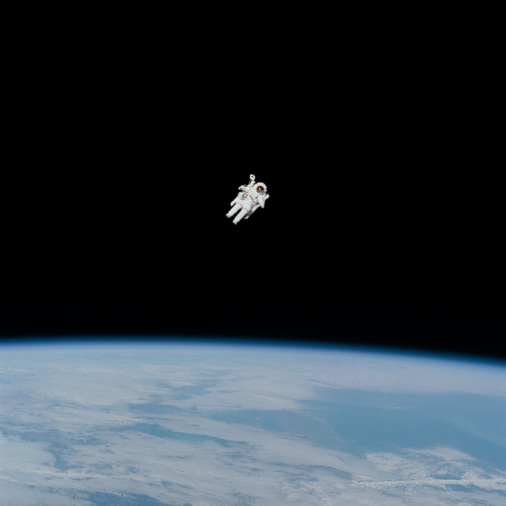

# S2 E21 Rick & Morty：我们不需要的英雄

<figure>
    <figcaption></figcaption>
    <audio
        controls
        src="./audio.mp3">
            Your browser does not support the
            <code>audio</code> element.
    </audio>
</figure>

在上一集的小声喧哗解读Rick and Morty中，小声喧哗找了两位非常硬核的物理学家来解读里面关于多重宇宙、科学和理性等等概念和这些概念在片中的呈现。由于Rick and Morty的解读空间过于庞大，所以我们将这期分成上下两集，以下是第2集。

如果说上期的方向非常“硬”，那么这期的解读方向比较“软” （totally not a dick joke）。这期我们主要从文化和社会角度切入，重点聊Vindicator 3: The Return of Worldender和The Ricklantis Mixup这两集内容。

这期由@靠谱青年Ina 和@都市丽人阿花 主持，我们也请了老朋友李尔克和一位科幻作家苏民Mia来和我们聊Rick and Morty.

这期，我们聊了：

<ul>
<li>为什么超级英雄的形象被越来越多的影视和文学所瓦解？为什么我们这个年纪的年轻人，不被苦大仇深的超级英雄所打动？</li>
<li>为什么multiverse的设定指向了虚无主义？</li>
<li>Rick是如何消解掉古典叙事中的秩序、魔法和伦理？古典神话vs. 现代神话的张力如何体现？</li>
<li>几位惨死的Vindicators的超级英雄人物原型对照是哪些？</li>
<li>为什么大家一直认为The Ricklantis Mixup这集是当之无愧的神剧？短短二十多分钟的4条完整故事线指向了哪些牛逼的命题？</li>
<li>为什么说Rick and Morty表面上是对当代电视剧集/漫画叙事模式的反叛，可本质上仍然无法突破当代多媒体娱乐神话的基本结构？</li>
<li>从一个科幻作家的角度来看，Rick and Morty给了怎样的启发？在上一集的小声喧哗解读Rick and Morty中，小声喧哗找了两位非常硬核的物理学家来解读里面关于多重宇宙、科学和理性等等概念和这些概念在片中的呈现。由于Rick and Morty的解读空间过于庞大，所以我们将这期分成上下两集，以下是第2集。</li>
</ul>

