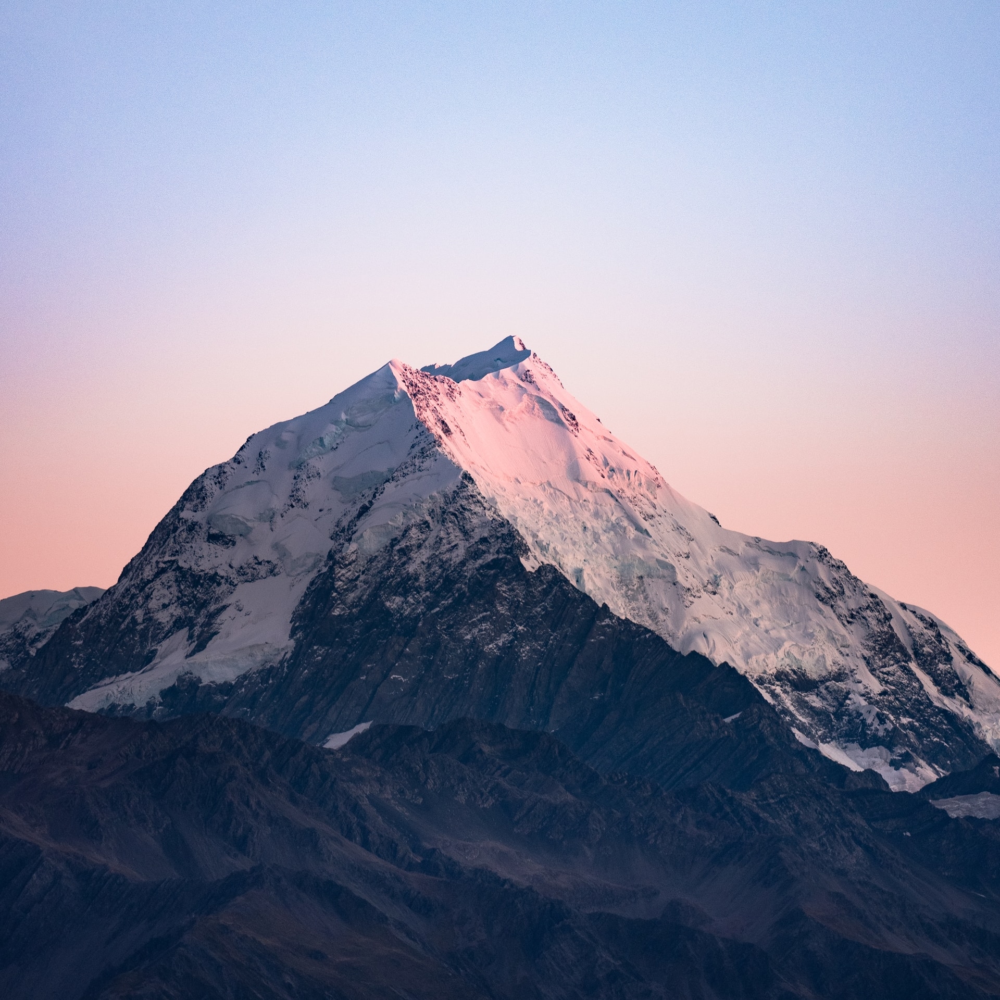

# S2 E10 对话大山：一个全球主义者和他的存在主义危机

<figure>
    <figcaption></figcaption>
    <audio
        controls
        src="./audio.mp3">
            Your browser does not support the
            <code>audio</code> element.
    </audio>
</figure>

像我们几个主播这样身上打满了中国的时代印记，却在人生最关键的几年浸淫在欧美文化环境中的人，在现在的中文互联网上并不少见。我们每一个人都是一个复杂的人类学标本，国企下岗、改革开放、WTO、911、奥运会，到后来的ISIS、川普当选、脱欧、贸易战，每一个事件都深刻地影响了我们的生活轨迹和思维方式。

@大山 老师是和我们一样的合成体，构成却很不一样。在一个东西文化和意识形态逐渐“你我分明”的时代中，大山一直坚持代表自己，并通过这样的坚持寻找中西文化中的共性。

他的惯用语、思维方式和灵活或委婉的说法，像一个谦和自省、从儒家环境里浸淫出来的中国60后知识分子。而大山对于新事物的思考、对国际化的热情、对种族问题的反思，又让我们觉得他也是一个内心冲突很多，而且格外自省的当代青年。

大山主动把自己和马男波杰克“BoJack”放置到同一个宇宙中，证明了他和BoJack恰好相反——他从未停滞，他依旧在吸收这个年代最前卫晦涩的幽默。在和小声喧哗邮件交流和录制过程中，他给自己的过去打上了1.0, 2.0, 3.0这样不断迭代的标签。

即使他说“I was famous in the 90s”, 大山的自我迭代让他一直和这个时代动态地变化着。这不是一集普通的小声喧哗节目，而是一个和大山本人剖析“大山作为文化现象”的一集——作为中国流行文化的一个元素，大山如何凝视他的舞台形象、他的外国/中国身份？

在这期小声喧哗@都市丽人阿花 @Izzy-牧歌 @靠谱青年Ina 和@是你的老杨SY 和大山一起录制的特别节目里，我们和他聊了如下话题：
⛰️最近大山又在很多社交媒体上活跃，尤其是“大山侃大山”单人脱口秀。银幕下的他这些年都经历了什么？最近他在忙什么？
⛰️“大山”在80-90年代的舞台形象是也是一个复杂的文化现象。他对于自己塑造的“大山”这个舞台形象怎么看？面对这么多让人舒服或者不舒服的解读，他自己本来想要表达的是什么？
⛰️大山面对现在那些对美剧英剧格外熟稔的年轻观众如何去弥合和他们之间的距离？
⛰️大山曾经在微博上直白地承认了自己早年Blackface（扮黑脸）的历史。然而，在中国的文化情境下，对于有色人种的歧视并不是一个每个普通人都会思考或是是遇到的问题，不像在北美这是一个切合了许多人利益的严肃话题。当时分享这个故事是出于一个什么想法呢？
⛰️大山在90年代某个国宴偶遇长者，他们之间发生了什么样的趣事？
⛰️大山为什么特别希望能去中国的小城市里演出？

