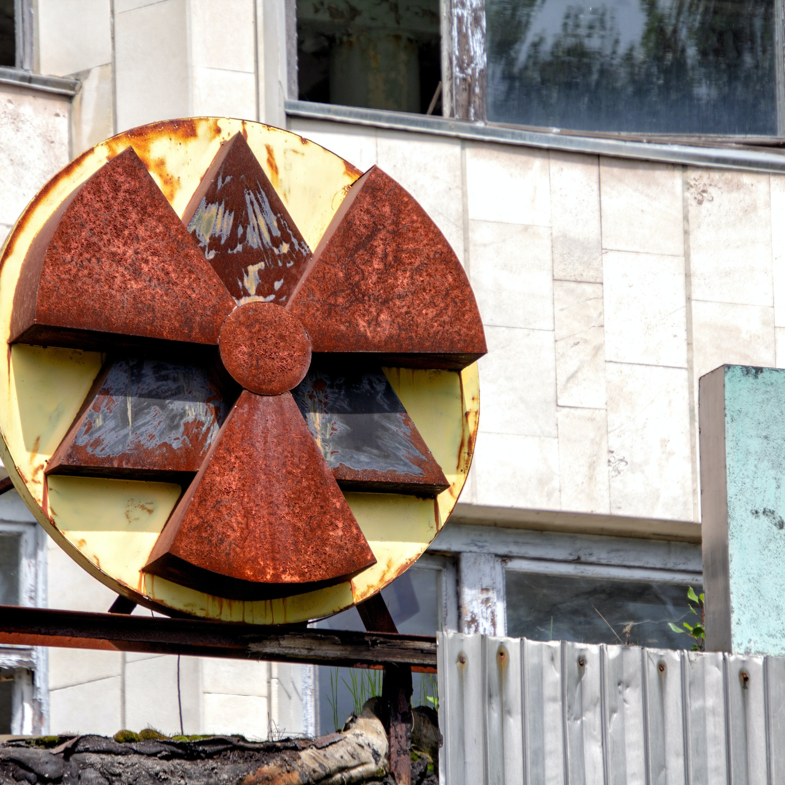

# S2 E13 切尔诺贝利：和物理学家聊核工业、科学主义、重建历史

<figure>
    <figcaption></figcaption>
    <audio
        controls
        src="./audio.mp3">
            Your browser does not support the
            <code>audio</code> element.
    </audio>
</figure>

HBO出了一部IMDB历史上评分最高的电视剧《切尔诺贝利》，让全球观众重新体验了几十年前切尔诺贝利核电站爆炸事件———人类历史上和核电历史上最严重的灾难之一。这个灾难最初造成30多人死亡（在随后的几年中死亡人数更多）并且在苏联和欧洲大片地区蔓延放射性污染。
在这期小声喧哗中，我们请来了Cheng Yangyang博士。来自中科大少年班的Yangyang学姐从小在新中国成立以后核能源探索的起点——中科大的校园长大。她大学时读了物理学的本科，之后，她从芝加哥大学拿到了物理学博士，现在在康奈尔大学继续博士后研究。Yangyang关注的科学领域是对撞机物理。今年起，她给SupChina写一档关于科学与中国的专栏。她的英文写作真诚而具有诗意。其中，对于她自己亲历高考的故事“The Highest Exam”和以中国人身份在美国学习物理时对于身份、国界的疑惑和探索的文章My Science Has No Nationality几乎是一发表，就在英文世界引起了海啸般的影响。

同时，这期还有我们的主播@Izzy-牧歌 , @都市丽人阿花 和@是你的老杨SY 的参加。
这期，小声喧哗和Yangyang聊了：

<ul>
<li>切尔诺贝利作为真实历史事件给我们带来的启示？我们在在在灾难下如何面对这两种谎言，关于人性和苏联体系的谎言。科学主义和共产主义在怎样的程度上推动了这场谎言？和共产主义中的唯物论在灾难蔓延时是怎样的角色？</li>
<li>以科学名义的政权与自然较量的历史，中国人都很熟悉。那么，科学是超越意识形态的，没有政治成分吗？</li>
<li>为什么这个剧集没有让演员讲有俄罗斯口音的英语？”没有口音”对场景还原的作用有多大？</li>
<li>这个在电视剧中戏份不多，但是这个消防队员的妻子的角色Lyudmilla Ignatenko的视角非常特别，这个人物的原型是怎样的？在诺贝尔文学奖Alexievich的书中，她是如何复述自己丈夫和孩子以及自己在切尔诺贝利的遭遇？</li>
<li>在男性主导的核工业，女性的身体如何以非常形象的方式记录并表达这种跨越时空的后果。在芝加哥大学物理系外面有个象征核能量的地标性的雕塑如何塑造了Yangyang对于科学的理解？</li>
</ul>

