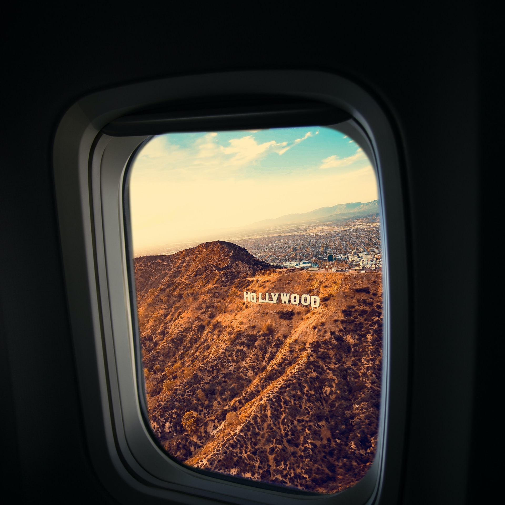

# S2 E14 好莱坞往事：那些昆汀影片中的私心、偏见、梦幻、和致敬

<figure>
    <figcaption></figcaption>
    <audio
        controls
        src="./audio.mp3">
            Your browser does not support the
            <code>audio</code> element.
    </audio>
</figure>

昆汀的第九部长片《好莱坞往事》在面世前就因为题材和卡司，而格外受瞩目。小声喧哗的@都市丽人阿花 @靠谱青年Ina 和@是你的老杨SY 在《好莱坞往事》上映后的第一时间就赶去看了。我们觉得这部影片实在有太多的层面可以讨论，在褒贬都有的情况下，我们决定聊一期好莱坞往事》。这一期，我们请来了老朋友李尔克。

《好莱坞往事》其实是一部filmography，电影作品年表。其实这部影片的时代背景非常值得深究昆汀选择的1969年，恰逢西部片刚刚走向衰败之路；电影用致敬和戏仿构建了一个上世纪60年代的好莱坞世界：电视的兴盛，孤注一掷投拍大制作影片的大制片厂的衰败，当然，还有以波兰斯基为首的欧洲电影人前来好莱坞拍片吸金等。为什么昆汀要用尽全力去还原这个年代？

<ul>
<li>为什么说这是一部非常私人的电影？这是昆汀“写给上世纪60年代电影的情书”，整部《好莱坞往事》，这种可能带着点悬疑、带着点传记色彩，更多是一场“往事”的，真是有些意识流的电影，是昆汀的创新吗？</li>
<li>莱昂纳多和布拉德皮特饰演的两个人物，是怎样的一种对于好莱坞整个时代的浓缩？为什么昆汀会创造出这两个角色？</li>
<li>昆汀如何体现嬉皮士 vs. 西部片英雄的对峙以及当时两种价值观的对峙？</li>
<li>昆汀在电影中如何丑化和羞辱了李小龙？“李小龙被揍”的情节，对于一个已经过世、在60年代好莱坞摸爬滚打的华裔演员，有什么问题？</li>
<li>电影中的女性角色为什么遭到如此多批评？</li>
</ul>

