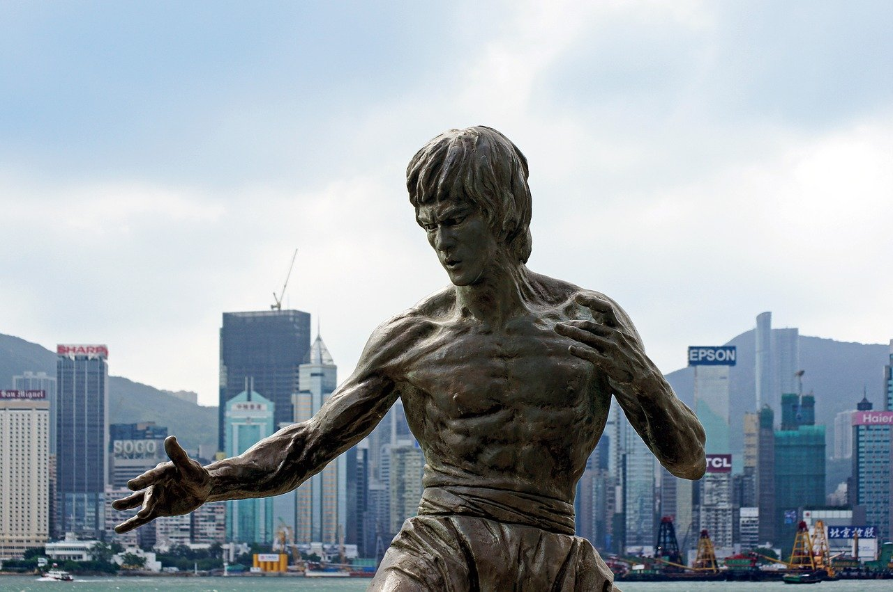

# S2 E15 好莱坞电影选角冒犯了谁

<figure>
    <figcaption></figcaption>
    <audio
        controls
        src="./audio.mp3">
            Your browser does not support the
            <code>audio</code> element.
    </audio>
</figure>

从迪士尼电影《花木兰》定角刘亦菲，再到先导预告片放出，最后到中文世界吵得不可开交——关于好莱坞电影中的种族表达和文化表达的争议从来不绝于耳。这期小声喧哗，我们请来了纽约州立大学的电影系任教的@黄小邪在纽约。

从小美人鱼定角黑人，到上气和满大人辱华，再到邦德的选角, 每个角色的争议点，都在于它们的文化表达 (cultural representation) 脱离了我们的舒适区，因此，我们觉得扎眼。在塑造种族观这件事情上，好莱坞背负了原罪，而我们也在不自知地吸收着许多种族观，而将某类审美趣味投射在新电影的角色选择上。

和黄小邪老师一起，小声喧哗的两位主播@都市丽人阿花 和 @依旧是你们的老杨 从以下几个角度分析了这些选角争议：

<ul>
<li>好莱坞最近在资本驱使下对种族和性别的的处理是好事还是坏事？这样的“多元”是资本下的伪装，还是真正的良性变革？</li>
<li>看到非白人的小美人鱼，为什么我们会感到审美被挑战、甚至觉得被冒犯？为什么看到黑人演的小美人鱼，我们就觉得“毁童年”，甚至鱼将不鱼？</li>
<li>好莱坞的技术、镜头语言引导了观众和哪位角色认同——这样的“代入感”为什么常常会让少数族裔觉得撕裂？</li>
<li>国内比较单一的审美系统(特别是女性艺人）和好莱坞日趋多元的审美系统有冲突吗？</li>
<li>殖民主义在我们的审美系统中扮演了怎样的角色？好莱坞是如何和殖民主义共存？</li>
<li>《残花泪》等早期好莱坞电影折射出怎样的白人对亚裔的歧视视角？</li>
<li>符号主义是什么？为什么上气、满大人等角色（在早期漫画中）都是符号主义的产物？</li>
</ul>

