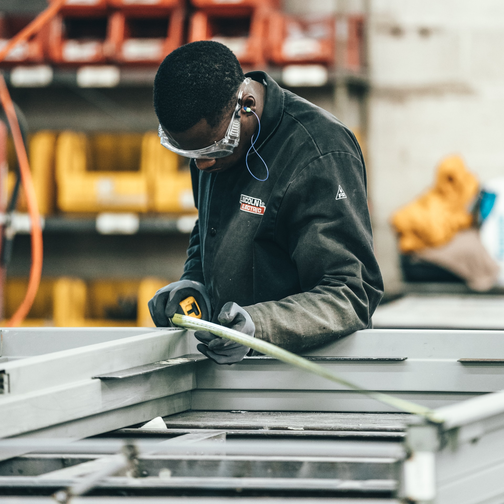

# S2 E17 美国工厂，福耀人间

<figure>
    <figcaption></figcaption>
    <audio
        controls
        src="./audio.mp3">
            Your browser does not support the
            <code>audio</code> element.
    </audio>
</figure>

全球化、自动化、资本的跨境流通等等这些概念对一个普通老百姓的影响，究竟有多大？从桌子上摆放的饭碗里的食物，到一个普通美国工人对于自己生命价值的思考——全球化还尚未被反思够吗？它究竟是什么？

《美国工厂》一上映，就在中美两国都引发了很多思考：关于全球化、资本外流、贸易战、劳工公会、自动化、包括中国的劳动者权益等等大的话题。这个纪录片里，一个个真实的个体在全球化的洪流中，被教科书中的宏大概念所影响。福耀工厂中上千名美国蓝领工人和在中国的数万工人，在记录片的镜头下，成了研究这些话题的最好的案例。

这次，小声喧哗想和你坐下来，聊聊这些在经济学101中需要探讨的宏大概念，也从其他角度，聊聊纪录片手法、背后的政治话语、还有里面活生生的人们。

这次，小声喧哗邀请了在纽约做金融咨询的朱大师，还有做过记者的布朗大学政治学博士张哲老师。参加这期节目的常驻主播有Izzy, 刁刁还有Afra.

这期，我们聊了：

<ul>
<li>片子在美国和中国的反响分别是怎样的？</li>
<li>这个故事背后的复杂社会议题是什么—为什么福耀会选择来美国建厂，从”外商直接投资（FDI)的角度来说，为什么福耀需要在美国开展生产线？</li>
<li>汽车组装的供应线流程是怎样的？这个行业的利润有多少？曹德旺在美国投资时，到底在想啥？发展中国家FDI vs. 发达国家FDI的区别是什么？</li>
<li>这部电影的制片公司是奥巴马夫妇的Higher Ground Productions，为什么奥巴马夫妇愿意关注这部纪录片？</li>
<li>工会在美国工人的生活中有怎样的影响力？美国工会的历史是怎样的？</li>
<li>这部纪录片中最魔幻的地方在哪里？</li>
</ul>

同时，附上端传媒上的一篇神作：《中国老板，美国工厂》
<a href="https://theinitium.com/article/20190911-opinion-america-factory-global-industry-chain/">https://theinitium.com/article/20190911-opinion-america-factory-global-industry-chain/</a>

以及张哲老师的报道《超越争议的非洲开发 中国在赞比亚的真实存在》
<a href="http://www.infzm.com/content/43550">http://www.infzm.com/content/43550</a>

