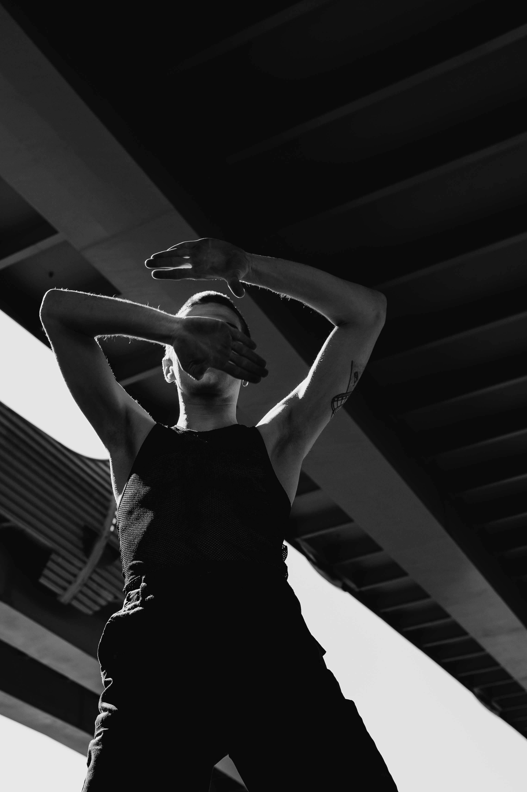

# S3 E20 「这！就是街舞」与「Legendary」— 反叛的舞蹈和温顺的综艺

<figure>
    <figcaption></figcaption>
    <audio
        controls
        src="./audio.mp3">
            Your browser does not support the
            <code>audio</code> element.
    </audio>
</figure>

这一期节目，我们和@八百伊万里聊了两期热播综艺——优酷的《这！就是街舞》和HBO Max的《Legendary》。我们聊到了我们对这两部节目的看法，在舞蹈社群中的体验和对舞蹈社群的期待，还有我们在舞蹈中体验到的自我革命和自我实现。八子也借这个机会给我们科普了Voguing舞种和Voguing社群的形式和历史。

3:34 对「这就是街舞」 的第一印象
5:54 「这就是街舞」 可以改名叫 「这就是男人」
6:24 女性舞者在综艺中被边缘化的处境
14:29 舞者们应该拥有“正常”和“多元”的身体。
19:34 屏幕里面放什么画面，画面里的人长什么样子真的是很重要的事
21:04 「这！就是街舞」每一季都有非常多非常queer的人，节目如何处理？
23:00 介绍HBO Max的舞蹈综艺节目“Legendary” 
23:32 Voguing舞种是什么? 
24:35 Ballroom文化是什么？
28:01 纪录片「燃烧巴黎」Paris is Buring中记录了怎样的voguing历史？社群如何从地面浮出到地上？
36:38 “竖起了一个高墙”阶级问题在voguing社群中依然存在
37:48 李二毛的故事
44:36 街舞的每个亚种的激烈的自我表达背后，都有关于种族性别的复杂故事

文案展开阅读以及我们提到的作品链接：

<ul>
<li>E410.「人妖」李二毛的一生 <a href="https://podcasts.apple.com/us/podcast/e410-%E4%BA%BA%E5%A6%96-%E6%9D%8E%E4%BA%8C%E6%AF%9B%E7%9A%84%E4%B8%80%E7%94%9F/id1256399960?i=1000490903720">故事fm</a></li>
<li><a href="https://www.nowness.cn/story/voguing-shanghai-ballroom">VOGUING! SHANGHAI! 聚焦中国首个 Ballroom 文化平台 </a></li>
</ul>

为了保证大家可以及时稳定收到我们的播客，我们推荐大家使用泛用性播客客户端订阅我们的播客。以苹果播客为例，你可以打开苹果自带的播客客户端，选择“资料库”右上角点击编辑，并点击“通过URL添加节目”，粘贴我们的RSS Feed。感谢大家收听本期节目，也可以在iTunes, Google Play, Spotify, CastBox等各大平台上找到我们。我们期待你的留言！

<ul>
<li>RSS feed: <a href="https://loudmurmursfm.typlog.io/episodes/feed.xml">https://loudmurmursfm.typlog.io/episodes/feed.xml</a></li>
<li>Itunes: <a href="https://apple.co/2rzhtXV">https://apple.co/2rzhtXV</a></li>
<li>Google play: goo.gl/KjRYPN</li>
<li>Spotify: <a href="https://spoti.fi/2IWNuRB">https://spoti.fi/2IWNuRB</a></li>
<li>Stitcher: <a href="https://www.stitcher.com/s?fid=544416&amp;refid=stpr">https://www.stitcher.com/s?fid=544416&amp;refid=stpr</a></li>
<li>Pocket Cast: <a href="http://pca.st/nLid">http://pca.st/nLid</a></li>
<li>Overcast: <a href="https://bit.ly/2SL7MNJ">https://bit.ly/2SL7MNJ</a></li>
<li>小宇宙：<a href="https://www.xiaoyuzhoufm.com/podcast/5e280fab418a84a0461fa548">https://www.xiaoyuzhoufm.com/podcast/5e280fab418a84a0461fa548</a></li>
</ul>

如果您喜欢我们的节目，欢迎通过爱发电支持我们：
<a href="https://afdian.net/p/e0a54e82ebd111e9bd2d52540025c377">https://afdian.net/p/e0a54e82ebd111e9bd2d52540025c377</a>
如果需要洽谈商业合作，可以用邮箱联系我们：loudmurmursfm@gmail.com

