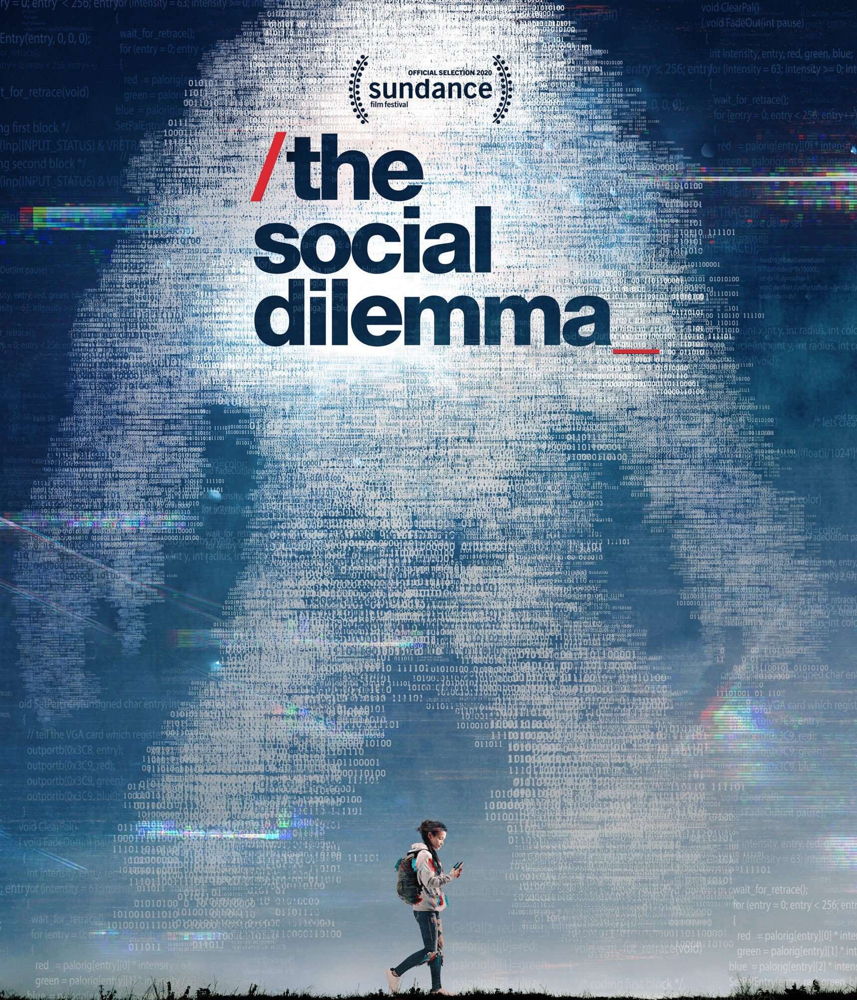

# S3 E22 社交陷阱（上）：图灵啊，我们做了什么？

<figure>
    <figcaption></figcaption>
    <audio
        controls
        src="./audio.mp3">
            Your browser does not support the
            <code>audio</code> element.
    </audio>
</figure>

一两个月前，《监视资本主义：智能陷阱》这部纪录片在Netflix上线时，恰好外卖小哥被困在系统里的文章横扫了中文互联网。“算法”、“优化”、“个性化推荐”等等词语背后的科技，构造了一个触目惊心的世界——黑箱算法所做出的决定，影响着我们生活的方方面面。而我们作为机器的数据“原材料”，被吸在屏幕前日夜不倦，不知不觉被剥削。

正如片名所说，这不仅对手机荧幕前的你是一个引诱你上瘾的陷阱，对于以此为生的大企业来说，对成千上万个胸怀志向的程序员和数据分析师来说，这个犹如陷阱般的行业也带来了无数个关于选择、价值的困顿时刻。

这期小声喧哗分为上下两集，以纪录片《监视资本主义：智能陷阱》作为讨论起点。我们请来了小风和老赵两位生活和工作在美国科技公司的朋友，以从业者自身的矛盾和反思讲起，梳理一遍我们的思维——

<ul>
<li>0:00 纪录片简介与主播、嘉宾对纪录片的第一看法</li>
<li><a href="https://loudmurmursfm.com/feed/audio.xml#t=12:30">12:30</a> “监视资本主义”是什么？</li>
<li><a href="https://loudmurmursfm.com/feed/audio.xml#t=15:50">15:50</a> 数据从业者接触到监视资本主义理论之后对自己工作的重新审视，以及内心的纠结和矛盾</li>
<li><a href="https://loudmurmursfm.com/feed/audio.xml#t=27:00">27:00</a> “上瘾”行业是什么？你们和上瘾机制的关系是什么样的？</li>
<li><a href="https://loudmurmursfm.com/feed/audio.xml#t=37:00">37:00</a> 上瘾行业自古有之；为什么有了技术的加持，情况格外的让人紧张？</li>
</ul>

本期节⽬由睡眠环境品牌「躺岛」⽀持，淘宝搜索「猫肚皮枕」找客服回复「小声喧哗」，或者复制￥kRyncQU6Dgs￥在淘宝打开，即可领取主播专属优惠。

为了保证大家可以及时稳定收到我们的播客，我们推荐大家使用泛用性播客客户端订阅我们的播客。以苹果播客为例，你可以打开苹果自带的播客客户端，选择“资料库”右上角点击编辑，并点击“通过URL添加节目”，粘贴我们的RSS Feed。感谢大家收听本期节目，也可以在iTunes, Google Play, Spotify, CastBox等各大平台上找到我们。我们期待你的留言！

<ul>
<li>RSS feed: <a href="https://loudmurmursfm.typlog.io/episodes/feed.xml">https://loudmurmursfm.typlog.io/episodes/feed.xml</a></li>
<li>Itunes: <a href="https://apple.co/2rzhtXV">https://apple.co/2rzhtXV</a></li>
<li>Google play: goo.gl/KjRYPN</li>
<li>Spotify: <a href="https://spoti.fi/2IWNuRB">https://spoti.fi/2IWNuRB</a></li>
<li>Stitcher: <a href="https://www.stitcher.com/s?fid=544416&amp;refid=stpr">https://www.stitcher.com/s?fid=544416&amp;refid=stpr</a></li>
<li>Pocket Cast: <a href="http://pca.st/nLid">http://pca.st/nLid</a></li>
<li>Overcast: <a href="https://bit.ly/2SL7MNJ">https://bit.ly/2SL7MNJ</a></li>
<li>小宇宙：<a href="https://www.xiaoyuzhoufm.com/podcast/5e280fab418a84a0461fa548">https://www.xiaoyuzhoufm.com/podcast/5e280fab418a84a0461fa548</a></li>
</ul>

如果您喜欢我们的节目，欢迎通过爱发电支持我们：
<a href="https://afdian.net/p/e0a54e82ebd111e9bd2d52540025c377">https://afdian.net/p/e0a54e82ebd111e9bd2d52540025c377</a>
如果需要洽谈商业合作，可以用邮箱联系我们：loudmurmursfm@gmail.com

