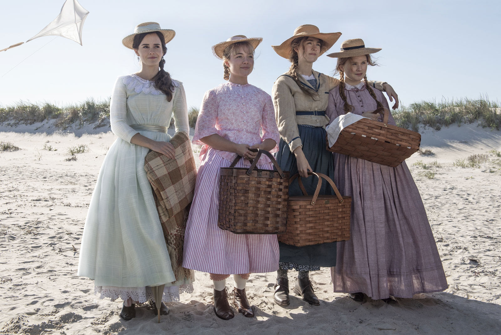

# S3 E2 小妇人的现代寓言：女性的自我实现和婚姻相互矛盾吗？

<figure>
    <figcaption></figcaption>
    <audio
        controls
        src="./audio.mp3">
            Your browser does not support the
            <code>audio</code> element.
    </audio>
</figure>

《小妇人》无论是小说还是电影，都充满了现代性——里面的许多矛盾，现代女性依然在经历；里面对于婚姻的观念甚至到今天都适用。这集小声喧哗，我们从原著和Greta Gerwig的电影的角度，解读了《小妇人》作为虚拟故事和当代寓言的意义。

这期节目由刁刁，Ina，娟儿和Afra四个人参与。我们聊了：

1.很久以来，女性创作者在创作女性角色的过程中都会遇到两难。Greta作为一个女性导演一定是理解小妇人的作者Alcott的。所以Greta作为导演选择叙事手法非常的巧妙，《小妇人》电影的结构精巧，Grata对它的改动尊重了原著，也糅合了现代元素，为什么这样的叙事手法精巧？

<ol start="2">
<li>
《小妇人》算是比较早的一个真的为青少年创作的小说。它里面的很多trope在我们现在看到的青春电影青春小说里一再被重复。《小妇人》和中国观众熟悉的琼瑶剧有什么相似处（请开脑洞）？

</li>
<li>
作者是一个生活在18世纪的，一个独立但是被同时代的人认为极其拧巴的作者，Alcott被要求写《小妇人》这本书之后写信给朋友抱怨说：我不喜欢女孩，也不认识什么女孩，除了我的姐妹们。《小妇人》有多大程度基于了Alcott自己的生活？

</li>
<li>
电影中体现了怎样的美国“女德观”？践行这种女德的角色为什么会给Jo（作者本人），以及荧幕下面的我们带来焦虑？

</li>
<li>
电影的温情和现实双结局如何解读？

</li>
<li>
Alcott本人可以一生未婚却不能让自己的女主角不结婚，这说明很多时候其实故事是要落后于现实的，正是因为一个卫道者们对于女性故事抱有的警惕也更多，Greta Gerwig不被提名，女性导演这么几十年来的成就被忽视也是这个道理。这样说来，哪些女性的困境是一百多年后我们仍在面对的？

</li>
</ol>

为了保证大家可以及时稳定收到我们的播客，我们推荐大家使用泛用性播客客户端订阅我们的播客。以苹果播客为例，你可以打开苹果自带的播客客户端，选择“资料库”右上角点击编辑，并点击“通过URL添加节目”，粘贴我们的RSS Feed。

感谢大家收听本期节目，也可以在iTunes, Google Play, Spotify, CastBox等各大平台上找到我们。我们期待你的留言！
RSS feed: <a href="https://loudmurmursfm.typlog.io/episodes/feed.xml">https://loudmurmursfm.typlog.io/episodes/feed.xml</a> 
Itunes: <a href="https://apple.co/2rzhtXV">https://apple.co/2rzhtXV</a>
Google play: goo.gl/KjRYPN 
Spotify: <a href="https://spoti.fi/2IWNuRB">https://spoti.fi/2IWNuRB</a> 
Pocket Cast: <a href="http://pca.st/nLid">http://pca.st/nLid</a> 
Overcast: <a href="https://bit.ly/2SL7MNJ">https://bit.ly/2SL7MNJ</a> 
如果您喜欢我们的节目，欢迎通过爱发电支持我们：
<a href="https://afdian.net/p/e0a54e82ebd111e9bd2d52540025c377">https://afdian.net/p/e0a54e82ebd111e9bd2d52540025c377</a>

