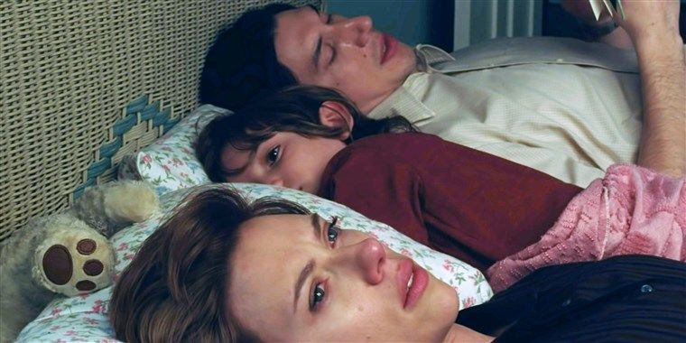

# S3 E1 一部讲述离婚的电影，也关于爱

<figure>
    <figcaption></figcaption>
    <audio
        controls
        src="./audio.mp3">
            Your browser does not support the
            <code>audio</code> element.
    </audio>
</figure>

[写在前面：小声喧哗第三季开始了。最近一段时间，我们每个人都不同程度地陷入了政治性抑郁。每天手机的小小的荧幕里都在飞快地爆出各种各样关于疫情的信息。我们其实非常想要做一期相关的内容，我们几个人都大脑处于宕机状态，具体要聊什么、要不要聊，仍在筹划状态。同时由于疫情原因，许多奥斯卡热门影片被撤档，包括大热的《婚姻故事》和《小妇人》等等也和国内观众无缘（心疼寡姐粉，甜茶粉）。于是我们按照原计划制作了《婚姻故事》和《小妇人》等节目，今天放出和老朋友游天龙老师聊的第三季第一集，《婚姻故事》]

“社会结构不接受[母亲的失败]，我们在精神上也不接受。 因为耶稣基督的母亲玛丽是犹太基督教这些传统的基础，所以她是完美的。 她是一个处女，能生孩子，养孩子，并在孩子去世后坚定不移胸怀大义般抱着它尸体。”

这是劳拉邓肯饰演的女律师振聋发聩的一段独白。也是《婚姻故事》让我们印象最深刻的片段之一。这部电影从一对婚姻分崩离析的夫妻出发，讲了美国中产的离婚故事——同时，它戳中了太多人的泪囊，我们在里面看到了个人价值实现和婚姻的冲突，爱以别的方式继续存在，感情的熄灭，和离异家庭里，父母争夺抚养权时的剑拔弩张。

我们邀请来了选·美的创始人游天龙老师，同时，他也想通过自己的经历，聊聊对于这部电影的感悟。这期由Ina和Afra主持。

《婚姻故事》这部电影由纽约的导演诺亚·鲍姆巴赫执导（插播八卦，他也是隔壁小妇人电影的导演Greta Gerwig的男朋友）。同时男主角是演技爆表的Adam Driver，大家熟悉的司机，女主角是斯嘉丽约翰逊，大家熟悉的寡姐。本电影由netflix网飞出品，在本届奥斯卡获得了六项提名，包括最佳影片，男女主角，女配，最佳剧本和音乐。

<strong>我们聊了:</strong>

片子为什么选择中产阶级作为离婚的中心？

《克莱默夫妇》和《鱿鱼和鲸鱼》中的离异体现了怎样的时代差异？

两方的律师在法庭上你死我活，现实中这种离婚升级成闹剧和不可控的灾难的可能性有多大？

为什么导演鲍姆巴赫说这是一个关于爱的故事，但是用离婚来讲述？

为啥这部电影离地感这么强？

美国的法律的复杂性是怎样的——游老师以亲历者和法律研究者的身份讲述。

<strong>我们提到的作品链接</strong>：

《克莱默夫妇》1979
《鱿鱼和鲸鱼》2005

感谢大家收听本期节目，也可以在iTunes, Google Play, Spotify, CastBox等各大平台上找到我们。我们期待你的留言！

RSS feed: <a href="https://loudmurmursfm.typlog.io/episodes/feed.xml">https://loudmurmursfm.typlog.io/episodes/feed.xml</a> 
Itunes: <a href="https://apple.co/2rzhtXV">https://apple.co/2rzhtXV</a>
Google play: goo.gl/KjRYPN 
Spotify: <a href="https://spoti.fi/2IWNuRB">https://spoti.fi/2IWNuRB</a> 
Pocket Cast: <a href="http://pca.st/nLid">http://pca.st/nLid</a> 
Overcast: <a href="https://bit.ly/2SL7MNJ">https://bit.ly/2SL7MNJ</a> 
如果您喜欢我们的节目，欢迎通过爱发电支持我们：
<a href="https://afdian.net/p/e0a54e82ebd111e9bd2d52540025c377">https://afdian.net/p/e0a54e82ebd111e9bd2d52540025c377</a>

