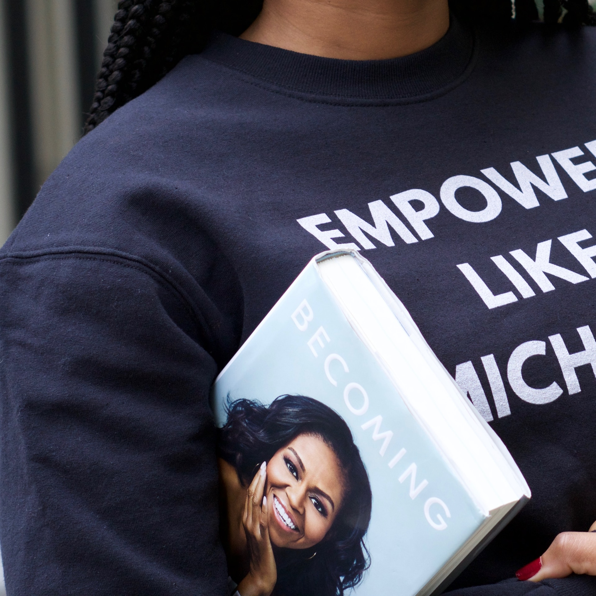

# S3 E12 这本书写给女性共同体：如何从「成为」中汲取力量？

<figure>
    <figcaption></figcaption>
    <audio
        controls
        src="./audio.mp3">
            Your browser does not support the
            <code>audio</code> element.
    </audio>
</figure>

大家对「四分之一人生危机」、「毕业焦虑」等等词语应该都不陌生。今天小声喧哗聊的这部纪录片，以及纪录片所关注的这本书，可能是许多人都需要的一剂良药。

米歇尔·奥巴马是如何被造就的？一个来自芝加哥南部贫穷黑人区的女孩不仅大步越过了父母的工人阶级，还一头冲破了人生中的所有天花板，成为了历史上最受欢迎、以及大众认为最有资格继续从政的美国第一夫人。当在她的政治遗产还在熠熠生辉时，在持续经历着”冒名顶替综合征”的我们——一群年轻女性，需要思考：米歇尔取用不仅的能量是如何被积累的？驱使她打碎天花板的原生动力从哪里来？她如何持续着这样一个贯穿一生的习惯：身边总围绕着一群关系亲密、昂扬向上的女性朋友，从而让她拥有了一处用女性智慧营造的避风港？这期节目由Afra和Ina主持，我们请来的嘉宾是在香港大学任教的郭婷博士，她是一位量产丰富的人类学学者，研究方向是女性主义和宗教。这期，我们聊一聊「成为：米歇尔·奥巴马自传」。

在这期节目中，我们聊了————

除了书中的能量和鸡汤，这本书忽略了美国哪些体制上的核心冲突？为什么说米歇尔的书是意识形态制造机，把种族问题说成是个人内心的斗争？

为什么说女性友谊是一个相对新的社会概念？为什么古代“女性友谊”完全不存在？

米歇尔的原生家庭如何造就了她？为什么兄长和父母的“重视”，是她做一切事情的基石？

第一夫人的角色在美国社会中的地位是怎样的？美国社会性别平等的日益增长的趋势如何呼应大众对第一夫人的想象？历史上有哪些著名的第一夫人定义了这个头衔？

作为精英女性，米歇尔·奥巴马从来没有试图让别人认为自己是“轻轻松松的人生赢家,” 她的书里为什么反复描写她人生中挣扎的时刻？为什么说这本书是写给女性共同体？

在白人精英主导的社会里，奥巴马夫妇是否要以白人精英的标准来要求自己？他们如何调整自己的定位？在种族分裂的美国推动议程？

书中和纪录片中如何描述了美国社会对于黑人的系统性压迫？呼应这次的BLM游行，为什么人们长久以来看不清系统性的压迫，而只是看到了顽疾和表象？有哪些故事，让我们意识到了黑人群体从出生以来就要面对的不公？

文案展开阅读以及我们提到的作品链接：
The Social Sex: History of Female Friendship by Marilyn Yalom
郭婷︱闺蜜史：友情是磅礴的革命
田安（Anna Shields）：《知我者：中唐的文人友谊与文学文化》（One Who Knows Me: Friendship and Literary Culture in Mid-Tang）

为了保证大家可以及时稳定收到我们的播客，我们推荐大家使用泛用性播客客户端订阅我们的播客。以苹果播客为例，你可以打开苹果自带的播客客户端，选择“资料库”右上角点击编辑，并点击“通过URL添加节目”，粘贴我们的RSS Feed。
感谢大家收听本期节目，也可以在iTunes, Google Play, Spotify, CastBox等各大平台上找到我们。我们期待你的留言！
RSS feed: <a href="https://loudmurmursfm.typlog.io/episodes/feed.xml">https://loudmurmursfm.typlog.io/episodes/feed.xml</a> 
Itunes: <a href="https://apple.co/2rzhtXV">https://apple.co/2rzhtXV</a>
Google play: goo.gl/KjRYPN 
Spotify: <a href="https://spoti.fi/2IWNuRB">https://spoti.fi/2IWNuRB</a> 
Pocket Cast: <a href="http://pca.st/nLid">http://pca.st/nLid</a> 
Overcast: <a href="https://bit.ly/2SL7MNJ">https://bit.ly/2SL7MNJ</a> 
如果您喜欢我们的节目，欢迎通过爱发电支持我们：
<a href="https://afdian.net/p/e0a54e82ebd111e9bd2d52540025c377">https://afdian.net/p/e0a54e82ebd111e9bd2d52540025c377</a>

