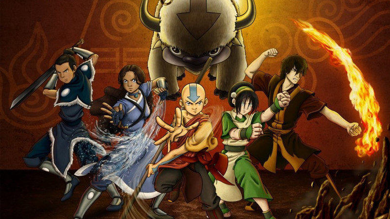

# S3 E13 「降世神通」：这部充满中国元素的动画影响了美国两代人

<figure>
    <figcaption></figcaption>
    <audio
        controls
        src="./audio.mp3">
            Your browser does not support the
            <code>audio</code> element.
    </audio>
</figure>

在2020年，有一部十五年前的动画片刚刚登陆Netflix就冲上了榜单第一名。在十五年前，它几乎塑造了美国千禧一代的记忆，到了今年，也有无数Gen Z迷上了这部剧，通过tik tok上的文化再创作养活了一大群亚文化账号，这部动画可以说在不到二十年内制造了两场席卷美国的文化现象。

这期小声喧哗就要聊这部神剧，「降世神通：最后的气宗」。这部动画是美国尼克频道在2005年播出的三季动画系列，故事发生在一个有亚洲色彩的世界中, 在这个世界里来自不同国度人们操纵”水/火/土/气”这四种元素。这个世界中的各个国家（气和牧族，火烈王国，土强国，水善部落）和睦相处了几百年，直到能够操纵火元素的火烈王国向其他国家发起战争，和平被打破。整个世界等待被拯救。

这样一个看似俗套的英雄拯救世界的动画，其美学和文化底色都大量借鉴中国和其他东亚国家的元素：从服饰，到宗教，到世界的构建。我们这期请来了「降世神通」铁粉卓扬，来和我们一起讨论剧内剧外的话题，卓扬是现居纽约的一名导演/制片，从纽约大学MBA/电影MFA项目毕业，一位妥妥的斜杠青年。同时，我们也采访了一位小时候就移民加拿大的朋友，Sijia，让她来聊聊作为在加拿大长大的华裔，在她小时候2005年看到「降世神通」时的意义如何？这期的主播是@Afra和@Juan.

同时，「降世神通」中体现的文化之间张力、编剧以及选用配音演员的决定，以及其电影改编版的问题，也是好莱坞以及大众文化中，反复被批判的弊病。其中的问题不仅仅是单个动画的个体问题，折射出了许多系统性的对于亚裔创作者的局限和阻力。

在这期小声喧哗，我们聊到了：

文化挪用和文化活用是什么？为什么「降世神通」中的亚洲元素的运用是一个非常好，但是又稀有的例子？

虚构故事中的泛亚身份（pan asian identity）和泛亚世界的建立是怎样的过程？ 「降世神通」让我们舒适和不舒适的元素有哪些？

卓扬作为身在美国的一名亚裔导演和编剧，有什么关于文化冲突的经历和体会？在今日的文化工业中，谁的故事能被讲出来？而哪些人的故事永远埋没在了千万个没有被选中的剧本中？为什么好莱坞需要结构性的改革？

为什么”完美女性“的角色设定是个陷阱？我们对女主角Katara有哪些不同的看法？

故事中两位主角，Aang和Zuko的任务发展线如何扣人心弦，让观众融入了他们的故事？如果说Aang的故事走向是郭靖那样的，那么Zuko应该就是一个升级版的欧阳克？

文案展开阅读以及我们提到的作品链接：

The Stunning Second Life of “Avatar: The Last Airbender”
<a href="https://www.newyorker.com/culture/culture-desk/the-stunning-second-life-of-avatar-the-last-airbender">https://www.newyorker.com/culture/culture-desk/the-stunning-second-life-of-avatar-the-last-airbender</a>

Official timeline of ATLA and comic books:
<a href="https://card.weibo.com/article/m/show/id/2309404470397344022728?_wb_client_=1&amp;object_id=1022%3A2309404470397344022728&amp;extparam=lmid--4470397346939216&amp;luicode=10000011&amp;lfid=231522type%3D1%26t%3D10%26q%3D%23%E9%99%8D%E4%B8%96%E7%A5%9E%E9%80%9A%EF%BC%9A%E6%9C%80%E5%90%8E%E7%9A%84%E6%B0%94%E5%AE%97%23&amp;featurecode=10000084">https://card.weibo.com/article/m/show/id/2309404470397344022728?_wb_client_=1&amp;object_id=1022%3A2309404470397344022728&amp;extparam=lmid--4470397346939216&amp;luicode=10000011&amp;lfid=231522type%3D1%26t%3D10%26q%3D%23%E9%99%8D%E4%B8%96%E7%A5%9E%E9%80%9A%EF%BC%9A%E6%9C%80%E5%90%8E%E7%9A%84%E6%B0%94%E5%AE%97%23&amp;featurecode=10000084</a>

Zuzu’s rap debut (no)
<a href="https://www.weibo.com/u/5525387911">https://www.weibo.com/u/5525387911</a>

结尾的宣传：
为了保证大家可以及时稳定收到我们的播客，我们推荐大家使用泛用性播客客户端订阅我们的播客。以苹果播客为例，你可以打开苹果自带的播客客户端，选择“资料库”右上角点击编辑，并点击“通过URL添加节目”，粘贴我们的RSS Feed。
感谢大家收听本期节目，也可以在iTunes, Google Play, Spotify, CastBox等各大平台上找到我们。我们期待你的留言！
RSS feed: <a href="https://loudmurmursfm.typlog.io/episodes/feed.xml">https://loudmurmursfm.typlog.io/episodes/feed.xml</a> 
Itunes: <a href="https://apple.co/2rzhtXV">https://apple.co/2rzhtXV</a>
Google play: goo.gl/KjRYPN 
Spotify: <a href="https://spoti.fi/2IWNuRB">https://spoti.fi/2IWNuRB</a> 
Pocket Cast: <a href="http://pca.st/nLid">http://pca.st/nLid</a> 
Overcast: <a href="https://bit.ly/2SL7MNJ">https://bit.ly/2SL7MNJ</a> 
如果您喜欢我们的节目，欢迎通过爱发电支持我们：
<a href="https://afdian.net/p/e0a54e82ebd111e9bd2d52540025c377">https://afdian.net/p/e0a54e82ebd111e9bd2d52540025c377</a>
商业合作请联系：loudmurmursfm@gmail.com

