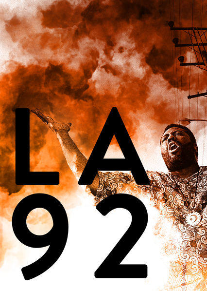

# S3 E16 「LA 92」与「为所应为」：少数族裔之间的冲突与团结

<figure>
    <figcaption></figcaption>
    <audio
        controls
        src="./audio.mp3">
            Your browser does not support the
            <code>audio</code> element.
    </audio>
</figure>

长久以来，亚裔对于暴力抗争的态度从来是避而远之的。都当我们看到熊熊燃烧的LA和一个充满倦怠和冲突的黑人街区时，亚裔和黑人同生存于同一空间的矛盾性便凸显出来。很多人隐隐约约觉得，黑人的抗争目标和亚裔实现美国梦是两个看似不太相关的路径。

这期，我们想要分析这个话题，在抗争和暴力中，亚裔和黑人能够站在同一战线吗？

这期是我们在全球的BLM运动以背景下做的第三期节目，主题是关于亚裔和黑人之间的冲突和团结。这次我们请来了黄琨和张跃然两个朋友来一起讨论两部风格迥异的影片：纪录片「LA 92」与美国导演斯派克·李的开山之作「为所应为」。这次我们邀请的嘉宾都对美国的社会运动有长久的研究，黄琨是康奈尔大学比较文学博士在读生，研究种族理论，特别是有关黑人和非洲的论述在近现代中国是如何被译介的。而张跃然是加州大学伯克利分校社会学博士在读生，也是一位美国社会运动参与者。

<strong>这期我们聊了：</strong>

<ul>
<li>
通过纪录片「LA 92」的呈现，我们如何理解“暴力”和“秩序”在美国种族问题上的复杂性？

</li>
<li>
“屋顶上的韩国人”是什么？这种形象如何被国内公众号放大？

</li>
<li>
亚裔和黑人复杂的种族关系如何在「LA 92」中被记录？为什么亚裔处于不黑不白的尴尬的第三角？为什么亚裔难以和共情黑人的经历？

</li>
<li>
在LA 1992年的冲突中，韩国人和黑人，以及街区的其他人如何采用“美国”这个符号来理解问题以及正当化行动，这种对“美国”的意义争夺说明了什么？

</li>
<li>
在将近三十年之后，2020的BLM运动和LA 92中的运动性质和诉求有哪些改变？什么变了？什么没有变？

</li>
<li>
黑人女性的死亡，和黑人男性被殴打，引起社会反响并不一样。性别在社会运动中如何被呈现？假如这次只有Breonna Taylor被警察暴力夺走生命，人们是否还会一样愤怒？为什么2020BLM和LA 92的的icon都是男性？

</li>
<li>
在「为所应为」中，在一个布鲁克林的黑人街区这个狭小的空间里，包含了哪些缩影，当意大利移民、韩国移民、拉丁美裔和黑人在不断互动时，冲突是怎样的？

</li>
<li>
Spike Lee电影中不断出现的马丁路德金和Malcolm X元素是怎样的：暴力抗争者和温和抗争者之间的矛盾（一拳Love一拳Hate）如何被呈现出来？

</li>
<li>
「为所应为」故事中的压迫链条是怎样的？

</li>
<li>
为什么黑人小哥的摸鱼行为，也是对于压迫的反抗？

</li>
</ul>

<strong>文案展开阅读以及我们提到的作品链接：</strong>

<ul>
<li>纪录片 <a href="https://vimeo.com/ondemand/catchinghell">Catching Hell in the City of Angels</a>，以及<a href="https://www.upress.umn.edu/book-division/books/catching-hell-in-the-city-of-angels">同名不同源的学术著作</a>，两者都是关于South Central LA的黑人社区</li>
<li><a href="https://www.youtube.com/watch?v=uaotkHlHJwo">LA 92 -- full documentary</a></li>
</ul>

为了保证大家可以及时稳定收到我们的播客，我们推荐大家使用泛用性播客客户端订阅我们的播客。以苹果播客为例，你可以打开苹果自带的播客客户端，选择“资料库”右上角点击编辑，并点击“通过URL添加节目”，粘贴我们的RSS Feed。
感谢大家收听本期节目，也可以在iTunes, Google Play, Spotify, CastBox等各大平台上找到我们。我们期待你的留言！

<ul>
<li>RSS feed: <a href="https://loudmurmursfm.typlog.io/episodes/feed.xml">https://loudmurmursfm.typlog.io/episodes/feed.xml</a></li>
<li>Itunes: <a href="https://apple.co/2rzhtXV">https://apple.co/2rzhtXV</a></li>
<li>Google play: goo.gl/KjRYPN</li>
<li>Spotify: <a href="https://spoti.fi/2IWNuRB">https://spoti.fi/2IWNuRB</a></li>
<li>Pocket Cast: <a href="http://pca.st/nLid">http://pca.st/nLid</a></li>
<li>Overcast: <a href="https://bit.ly/2SL7MNJ">https://bit.ly/2SL7MNJ</a></li>
</ul>

如果您喜欢我们的节目，欢迎通过爱发电支持我们：
<a href="https://afdian.net/p/e0a54e82ebd111e9bd2d52540025c377">https://afdian.net/p/e0a54e82ebd111e9bd2d52540025c377</a>
商业合作请联系：loudmurmursfm@gmail.com

