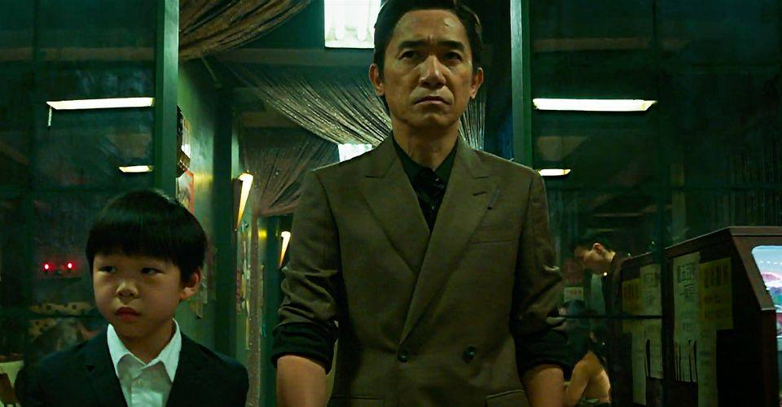

# S4 E24 「尚气」：亚裔漫威英雄的突破与局限

<figure>
    <figcaption></figcaption>
    <audio
        controls
        src="./audio.mp3">
            Your browser does not support the
            <code>audio</code> element.
    </audio>
</figure>

【聊了什么】

这期节目我们聊了聊漫威系列的最新电影，也是漫威在疫情之后第二部在影院上映的电影《尚气与十戒传奇》。尚气是漫威宇宙里第一位亚裔超级英雄，而主创们也大部分都是华人或者华裔。电影在上映之前就引发了不少争议；而在超低预期下看完的主播竟然觉得出乎意料的好看。我们聊了聊电影里中文台词、服化道、武打、玄幻等文化元素的处理，也聊了聊中国本土观众和亚裔观众视角的不同与冲突。

【直入内容】

<ul>
<li><a href="https://loudmurmursfm.com/feed/audio.xml#t=01:19">01:19</a> 嘉宾介绍与第一印象</li>
<li><a href="https://loudmurmursfm.com/feed/audio.xml#t=08:00">08:00</a> Marvel如何塑造让观众很容易爱上的“反英雄”</li>
<li><a href="https://loudmurmursfm.com/feed/audio.xml#t=15:00">15:00</a> 中文对白和口音是否站得住脚？</li>
<li><a href="https://loudmurmursfm.com/feed/audio.xml#t=26:24">26:24</a> 武打戏风格背后的传承，玄幻元素的重塑</li>
<li><a href="https://loudmurmursfm.com/feed/audio.xml#t=32:21">32:21</a> Awkafina作为史上第一个出场就是为了开车的亚裔女司机</li>
<li><a href="https://loudmurmursfm.com/feed/audio.xml#t=34:11">34:11</a> 塔罗村的故事是否经得起推敲？对标《黑豹》体现了什么样的弱点？这样地理和历史的模糊性是有必要的吗？我们需要亚裔的瓦坎达吗？</li>
<li><a href="https://loudmurmursfm.com/feed/audio.xml#t=49:00">49:00</a> 漫威用亚裔身份运动做营销，却并没有在电影里太深挖华裔美国人的故事</li>
<li><a href="https://loudmurmursfm.com/feed/audio.xml#t=51:20">51:20</a> 电影里流于表面的、礼节性的“女性主义”</li>
<li><a href="https://loudmurmursfm.com/feed/audio.xml#t=56:16">56:16</a> 我们还想看充满老套情节的《天仙配》吗？</li>
<li><a href="https://loudmurmursfm.com/feed/audio.xml#t=59:00">59:00</a> 作为中国本土观众，我们该如何看待亚裔作品中的文化符号？</li>
</ul>

【嘉宾是谁】

<ul>
<li>烤老师：播客越烤越糊的主播，现居纽约</li>
<li>Frankie: 华裔插画师和自由撰稿人</li>
</ul>

【剪辑老师】

Joshua

【股东是你】

如果您喜欢我们的节目，欢迎通过爱发电或者Patreon支持我们，所有支持过我们的小声喧哗精神股东都会被邀请进入独家听众群，和主播们成为姐妹，天天闲聊：

点这里进入小声喧哗的爱发电页面：
<a href="https://afdian.net/p/e0a54e82ebd111e9bd2d52540025c377">https://afdian.net/p/e0a54e82ebd111e9bd2d52540025c377</a>

点这里进入小声喧哗的Patreon页面：
<a href="https://www.patreon.com/loudmurmurs">https://www.patreon.com/loudmurmurs</a>

【作品外链】

<ul>
<li>越烤越糊 <a href="https://overcooked.typlog.io/">https://overcooked.typlog.io/</a></li>
<li>清醒梦播客救母那集<a href="https://hekukaixin.com/2021/05/22/%e6%b8%85%e9%86%92%e6%a2%a6-e18%ef%bd%9c%e4%b8%ad%e5%9b%bd%e6%96%87%e5%8c%96%e7%9a%84%e6%95%91%e6%af%8d%e4%bc%a0%e8%af%b4/">https://hekukaixin.com/2021/05/22/%e6%b8%85%e9%86%92%e6%a2%a6-e18%ef%bd%9c%e4%b8%ad%e5%9b%bd%e6%96%87%e5%8c%96%e7%9a%84%e6%95%91%e6%af%8d%e4%bc%a0%e8%af%b4/</a></li>
</ul>

【喧哗恰饭】

如果想要和小声喧哗进行商务合作，请发email到loudmurmursfm@gmail.com

或者添加微信号dowson1912

【如何收听】

你可以在iTunes, Google Play, Spotify, CastBox等各大平台上找到我们。我们期待你的留言！

<ul>
<li>RSS feed: <a href="https://loudmurmursfm.typlog.io/episodes/feed.xml">https://loudmurmursfm.typlog.io/episodes/feed.xml</a></li>
<li>Itunes: <a href="https://apple.co/2rzhtXV">https://apple.co/2rzhtXV</a></li>
<li>Google play: goo.gl/KjRYPN</li>
<li>Spotify: <a href="https://spoti.fi/2IWNuRB">https://spoti.fi/2IWNuRB</a></li>
<li>Pocket Cast: <a href="http://pca.st/nLid">http://pca.st/nLid</a></li>
<li>Overcast: <a href="https://bit.ly/2SL7MNJ">https://bit.ly/2SL7MNJ</a></li>
</ul>

