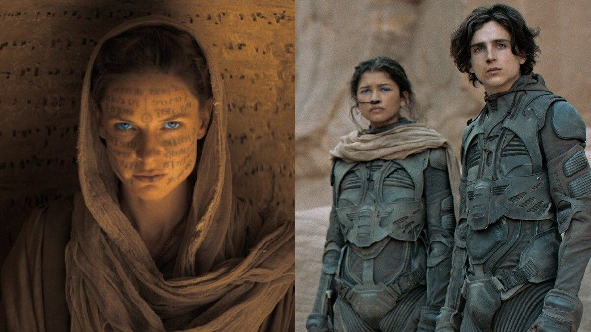

# S4 E27「沙丘」：生态学，致幻剂与白人救世主

<figure>
    <figcaption></figcaption>
    <audio
        controls
        src="./audio.mp3">
            Your browser does not support the
            <code>audio</code> element.
    </audio>
</figure>

【聊了什么】

小声喧哗终于聊了最近上映的科幻大片，维伦纽瓦导演执导的《沙丘》。我们邀请到了口译工作者、80年代时就看过了大卫林奇版本《沙丘》的白威廉，以及小声喧哗听众，生态学PhD洛君来一起和我们聊一聊沙丘的世界：未来世界的封建主义社会，巴特兰圣战设定下的科技发展，《沙丘》原著创作背后的社会历史背景，香料开采和生态危机，《沙丘》里的白人救世主与殖民主义，以及原著和电影对于女性角色的刻画。

<strong>本期节目由一个我们四个人都特别喜欢的，非常注重女性多元身材的生活方式品牌，NEIWAI内外，定制。在这期节目当中，我们在中段插播了一段关于产品试用的广告，如果你身在海外，可以使用LMM20折扣码，或者点击<a href="https://neiwai.us/LoudMurmurs">本链接</a>来购买内外的产品。另外还有国内NEIWAI内外官方旗舰店的优惠活动，详情请下滑。</strong>

【直入内容】

4:53《沙丘》第一印象：“音乐走进我心中”，“这不是一个trailer吗？”，“这只是一个开始”

<a href="https://loudmurmursfm.com/feed/audio.xml#t=11:05">11:05</a> 维伦纽瓦vs大卫林奇版本的对比

13:05《沙丘》的世界：科幻世界中的封建主义社会，未来世界为什么没有智能手机，巴特兰圣战

<a href="https://loudmurmursfm.com/feed/audio.xml#t=15:52">15:52</a> 硬科幻vs软科幻

<a href="https://loudmurmursfm.com/feed/audio.xml#t=16:45">16:45</a> 科学对世界宇宙的运作规律产生新的认识的影响；如果这个故事里没有外星人，我们还会认为他是科幻吗？

<a href="https://loudmurmursfm.com/feed/audio.xml#t=18:10">18:10</a> 反文化运动（counter culture movement）：弗兰克·赫伯特创造《沙丘》的社会历史背景

<a href="https://loudmurmursfm.com/feed/audio.xml#t=20:56">20:56</a> 香料的双重意义：致幻剂+类似石油一样的稀缺资源

<a href="https://loudmurmursfm.com/feed/audio.xml#t=22:26">22:26</a> 香料开采引发的生态学，环境上的冲突

<a href="https://loudmurmursfm.com/feed/audio.xml#t=24:51">24:51</a> 气候变化越来越紧迫，我们希望看到更多和自然关系的叙事；生态破坏影响着每个人的生活

27:34: 资源过剩的诅咒，赫伯特对于生态学的思考是人类中心主义的体现

<strong>31:08【广告植入】四位主播聊内外产品的体验：均码概念消除了对罩杯/女性身体的焦虑。如果你身在海外，可以使用LMM20折扣码，或者点击<a href="https://neiwai.us/LoudMurmurs">本链接</a>来购买内外的产品。</strong>

<a href="https://loudmurmursfm.com/feed/audio.xml#t=37:34">37:34</a> 《沙丘》中的白人救世主和殖民主义的叙事，电影创作中的文化挪用

<a href="https://loudmurmursfm.com/feed/audio.xml#t=42:52">42:52</a> 原作里的文化融合，原作创作的时候，流行文化里面暂时还没有把以宗教为动机的恐怖主义作为一个剧情推进来滥用

<a href="https://loudmurmursfm.com/feed/audio.xml#t=45:15">45:15</a> 电影对Fremen的处理，阿拉伯的劳伦斯叙述，保罗作为白人救世主的命运

<a href="https://loudmurmursfm.com/feed/audio.xml#t=48:28">48:28</a> 白威廉分享自己在这种（白人救世主的使命感）的流行文化下长大的个人经历

<a href="https://loudmurmursfm.com/feed/audio.xml#t=51:32">51:32</a> 《沙丘》中强有力的女性形象：杰西卡（妈妈），新版电影和林奇版本电影对于杰西卡的刻画区别

<a href="https://loudmurmursfm.com/feed/audio.xml#t=55:44">55:44</a> 林奇版本《沙丘》的恐同元素

<a href="https://loudmurmursfm.com/feed/audio.xml#t=57:10">57:10</a> 两部电影中对于男爵形象的刻画

59:02《沙丘》中强有力的女性形象：Chani（Zendaya饰演）

<a href="https://loudmurmursfm.com/feed/audio.xml#t=1:02:17">1:02:17</a> 《沙丘》这个电影在2021年被拍出来还有价值吗？

【哪位主播】

刁刁

Ina

Afra

娟

【嘉宾是谁】

白威廉

Luo Jun

【剪辑老师】

Josh Ogden-Davis 树华老师

【股东是你】

如果您喜欢我们的节目，欢迎通过爱发电或者Patreon支持我们，所有支持过我们的小声喧哗精神股东都会被邀请进入独家听众群，和主播们成为姐妹，天天闲聊：

点这里进入小声喧哗的爱发电页面：
<a href="https://afdian.net/p/e0a54e82ebd111e9bd2d52540025c377">https://afdian.net/p/e0a54e82ebd111e9bd2d52540025c377</a>

点这里进入小声喧哗的Patreon页面：
<a href="https://www.patreon.com/loudmurmurs">https://www.patreon.com/loudmurmurs</a>

【喧哗恰饭】

如果想要和小声喧哗进行商务合作，请发email到loudmurmursfm@gmail.com
或者添加微信号dowson1912

【其他外链】

除了海外的活动以外，还有在天猫上的双十一活动优惠：

NEIWAI内外官方旗舰店11/22-11/26 店内活动

部分款2件9折, 清仓款1件8折

内裤专区149/169/179任选三条

买保暖相关产品送高筒袜一双（1件商品送1双）

会员福利 -
会员卷：300减10

会员兑卷：

500积分兑换399-30卷 （截止12.31可用）

1000积分兑换599-50卷（截止12.31可用）

【如何收听】

你可以在iTunes, Google Play, Spotify, CastBox等各大平台上找到我们。我们期待你的留言！

RSS feed: <a href="https://loudmurmursfm.typlog.io/episodes/feed.xml">https://loudmurmursfm.typlog.io/episodes/feed.xml</a>

Itunes: <a href="https://apple.co/2rzhtXV">https://apple.co/2rzhtXV</a>

Google play: goo.gl/KjRYPN

Spotify: <a href="https://spoti.fi/2IWNuRB">https://spoti.fi/2IWNuRB</a>

Pocket Cast: <a href="http://pca.st/nLid">http://pca.st/nLid</a>

Overcast: <a href="https://bit.ly/2SL7MNJ">https://bit.ly/2SL7MNJ</a>

