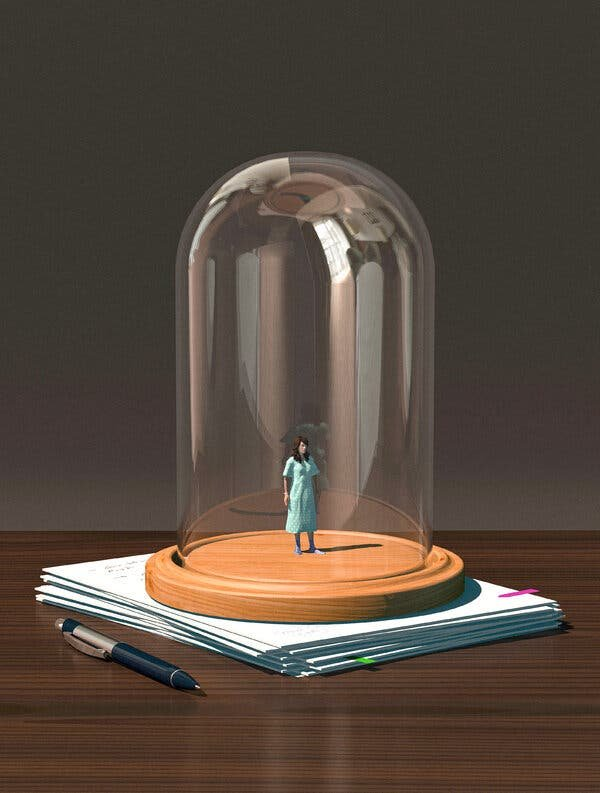

# S4 E26 肾，小说，和一场全网大战

<figure>
    <figcaption></figcaption>
    <audio
        controls
        src="./audio.mp3">
            Your browser does not support the
            <code>audio</code> element.
    </audio>
</figure>

<strong>【聊了什么】</strong>

一百个人眼里有一百个哈姆雷特，四位主播对纽约时报杂志席卷互联网的一篇文章 “Who is the Bad Art Friend” （翻译版本名：《肾、小说和女作家之战》）有着四种不同的理解。小声喧哗借此机会探讨社交媒体大环境下善举和善举背后的动机，女性作家的冲突为何被认为只是女人之间撕头花的故事，以及补充了中文互联网对本文的理解缺乏的一些关于美国的语境。

<strong>【直入内容】</strong>

<ul>
<li>
2:57 - 纽约时报杂志席卷互联网的一篇文章 “Who is the Bad Art Friend” （翻译版本名：《肾、小说和女作家之战》）到底讲了什么？

</li>
<li>
6:30 - 刁刁对于这篇文章的第一印象：这是一个关于做善事的权力关系的故事

</li>
<li>
<a href="https://loudmurmursfm.com/feed/audio.xml#t=11:00">11:00</a> - Afra觉得这篇文章点明了社会性和文学性的鸿沟，Larson的作品“The Kindest”讲了两个高度凝练的不完美的人的故事

</li>
<li>
<a href="https://loudmurmursfm.com/feed/audio.xml#t=14:00">14:00</a> - Ina意识到带着对白人女作家的刻板印象影响了自己对这篇文章的观感，但是捐肾本身是一个善举

</li>
<li>
<a href="https://loudmurmursfm.com/feed/audio.xml#t=18:00">18:00</a> - 娟儿觉得这是一个痛打落水狗的故事，强调了Dawn作为未被发表作家身份和Larson之间的区别；Larson对Dawn的诛心和异化不能被文学创作的理由正当化

</li>
<li>
<a href="https://loudmurmursfm.com/feed/audio.xml#t=26:30">26:30</a> - 补充了一些关于非定向捐肾背后的社会机制之后，我们对这个文章的感想发生了什么样的变化

</li>
<li>
<a href="https://loudmurmursfm.com/feed/audio.xml#t=33:30">33:30</a> - 社交媒体环境下，善举带来的权利；怀疑善举背后的动机是否可能是有害的

</li>
<li>
<a href="https://loudmurmursfm.com/feed/audio.xml#t=35:33">35:33</a> - 为什么这个故事会被很多人理解为女人和女人之间撕头花的故事？“Cat fight” 和 “mean girls”如何成为自我实现的预言; 如何抑制女性写作

</li>
<li>
<a href="https://loudmurmursfm.com/feed/audio.xml#t=46:00">46:00</a> - 少数族裔对白人女性女权主义的警惕

</li>
<li>
<a href="https://loudmurmursfm.com/feed/audio.xml#t=49:00">49:00</a> - 中文互联网对这篇文章的理解缺乏了哪些关于美国社会、政治的语境

</li>
<li>
<a href="https://loudmurmursfm.com/feed/audio.xml#t=1:02:00">1:02:00</a> - 原创音乐彩蛋！

</li>
</ul>

<strong>剪辑老师Joshua Ogden-Davis 原创歌曲</strong>

Well I gave away my kidney but my friends don’t even care

我捐了肾可是我朋友根本不在乎

I said I gave away my WHOLE kidney and my friends don’t seem to care an appropriate amount

我说我捐了一整颗肾脏但我朋友根本不够在乎（在乎的量不够）

But I know up in heaven White Jesus is saving me a chair

但我知道在天堂里（白人）耶稣给我留了个位置

Well I plagiarized a rando but she says she knows me

我抄袭了一个陌生人的故事但是她说她认识我

Well I plagiarized this rando and she says she knows me

我说我抄袭了一个陌生人的故事但是她说她认识我

But she ain’t cool enough for the group chat so she ain’t get no apology

不过她一点也不酷所以没法加入我的群聊，也不配得到道歉

<strong>【哪位主播】</strong>

刁刁

Ina

Afra

娟

<strong>【嘉宾是谁】</strong>

本期节目没有嘉宾

<strong>【剪辑老师】</strong>

Joshua Ogden-Davis

<strong>【假装听过】</strong>

读完《肾、小说和女作家之战》，到底谁是糟糕的艺术家朋友呢？说到底还是因人而异。

<strong>【股东是你】</strong>

如果您喜欢我们的节目，欢迎通过爱发电或者Patreon支持我们，所有支持过我们的小声喧哗精神股东都会被邀请进入独家听众群，和主播们成为姐妹，天天闲聊：

点这里进入小声喧哗的爱发电页面：
<a href="https://afdian.net/p/e0a54e82ebd111e9bd2d52540025c377">https://afdian.net/p/e0a54e82ebd111e9bd2d52540025c377</a>

点这里进入小声喧哗的Patreon页面：
<a href="https://www.patreon.com/loudmurmurs">https://www.patreon.com/loudmurmurs</a>

<strong>【作品外链】</strong>

肾、小说和女作家之战 -- 翻译 by 潘萌
<a href="https://mp.weixin.qq.com/s/pzqnGtdhEc089VeQQmHymw">https://mp.weixin.qq.com/s/pzqnGtdhEc089VeQQmHymw</a>

肾、小说和女作家之战：从道德、写作与身份的角度思考“糟糕艺术朋友” | 圆桌
<a href="https://m.jiemian.com/article/6741596.html">https://m.jiemian.com/article/6741596.html</a>

<strong>【喧哗恰饭】</strong>

如果想要和小声喧哗进行商务合作，请发email到loudmurmursfm@gmail.com
或者添加微信号dowson1912

<strong>【如何收听】</strong>

你可以在iTunes, Google Play, Spotify, CastBox等各大平台上找到我们。我们期待你的留言！
RSS feed: <a href="https://loudmurmursfm.typlog.io/episodes/feed.xml">https://loudmurmursfm.typlog.io/episodes/feed.xml</a> 
Itunes: <a href="https://apple.co/2rzhtXV">https://apple.co/2rzhtXV</a>
Google play: goo.gl/KjRYPN 
Spotify: <a href="https://spoti.fi/2IWNuRB">https://spoti.fi/2IWNuRB</a> 
Pocket Cast: <a href="http://pca.st/nLid">http://pca.st/nLid</a> 
Overcast: <a href="https://bit.ly/2SL7MNJ">https://bit.ly/2SL7MNJ</a>

