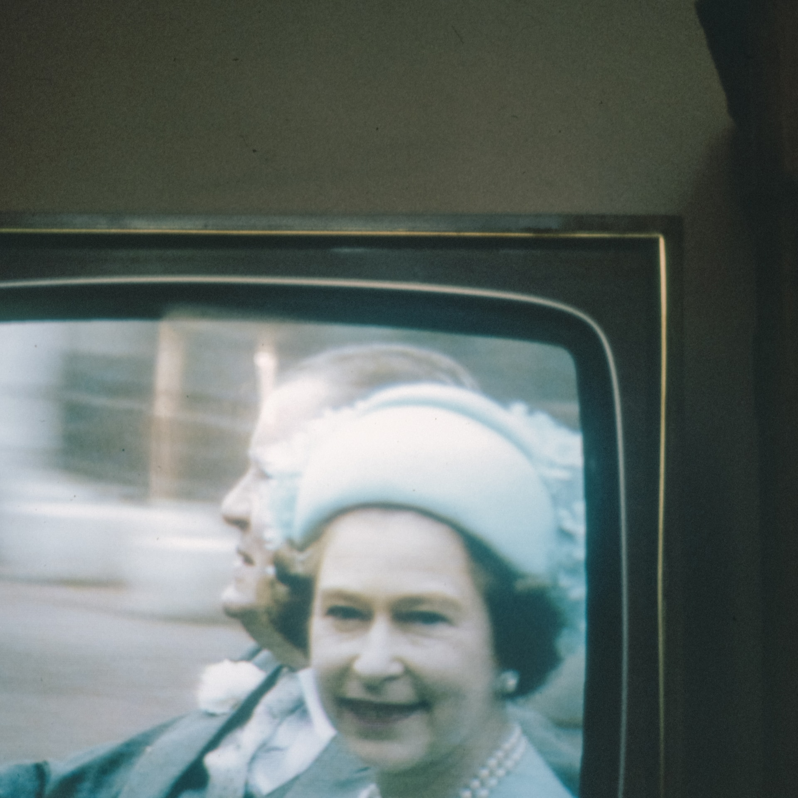

# S4 E5 躺在白金汉宫床底下替英国皇室操碎了心

<figure>
    <figcaption></figcaption>
    <audio
        controls
        src="./audio.mp3">
            Your browser does not support the
            <code>audio</code> element.
    </audio>
</figure>

长达一年窝在家里，小声喧哗的四位主播和舞台导演@抓马坤天天嗑皇室八卦嗑到不记得自己姓什么（比如抓马坤老师其实并不姓马，但是我们每次叫她马老师她也会发出自然的回应）。今年三月七日哈里王子夫妇和奥普拉的采访在中文和英文世界都掀起了轩然大波；我们终于按捺不住泄洪般的表达欲，架起麦克风录了一期节目。这一期中我们讨论了：

<ul>
<li><a href="https://loudmurmursfm.com/feed/audio.xml#t=03:05">03:05</a> 奥普拉采访里说了什么？为什么掀起了这么多讨论？</li>
<li><a href="https://loudmurmursfm.com/feed/audio.xml#t=11:25">11:25</a> 我们到底为什么知道这么多关于皇室的事情？难道白金汉宫每个床底下都躺了人吗？躺了多少人？Where do we sign up（划掉）？</li>
<li><a href="https://loudmurmursfm.com/feed/audio.xml#t=15:30">15:30</a> 我们熟悉的皇室这三代人：祖父母辈的女王、菲利普亲王和玛格丽特公主，父辈的查尔斯王子和戴安娜王妃，以及孙子辈的威廉夫妇和哈里夫妇</li>
<li><a href="https://loudmurmursfm.com/feed/audio.xml#t=45:00">45:00</a> 什么是“The Firm”？这个长得像一个家庭的公司、政治组织、文化现象到底是什么？我们该如何衡量他？</li>
<li><a href="https://loudmurmursfm.com/feed/audio.xml#t=51:59">51:59</a> 脱欧时代，英国遇到了重新思考“什么是英国”的契机；英国该如何想像一个新时代的王室？</li>
<li><a href="https://loudmurmursfm.com/feed/audio.xml#t=56:30">56:30</a> 观众的审视是有力量的；我们代入“贾母”的秩序维护者的角色，还是用现代的价值观去审视王室非常重要</li>
</ul>

感谢大家收听本期节目，也可以在iTunes, Google Play, Spotify, CastBox等各大平台上找到我们。我们期待你的留言！

<ul>
<li>RSS feed: <a href="https://loudmurmursfm.typlog.io/episodes/feed.xml">https://loudmurmursfm.typlog.io/episodes/feed.xml</a></li>
<li>Itunes: <a href="https://apple.co/2rzhtXV">https://apple.co/2rzhtXV</a></li>
<li>Google play: goo.gl/KjRYPN</li>
<li>Spotify: <a href="https://spoti.fi/2IWNuRB">https://spoti.fi/2IWNuRB</a></li>
<li>Pocket Cast: <a href="http://pca.st/nLid">http://pca.st/nLid</a></li>
<li>Overcast: <a href="https://bit.ly/2SL7MNJ">https://bit.ly/2SL7MNJ</a></li>
</ul>

如果您喜欢我们的节目，欢迎通过爱发电支持我们：

<ul>
<li><a href="https://afdian.net/p/e0a54e82ebd111e9bd2d52540025c377">https://afdian.net/p/e0a54e82ebd111e9bd2d52540025c377</a></li>
</ul>

