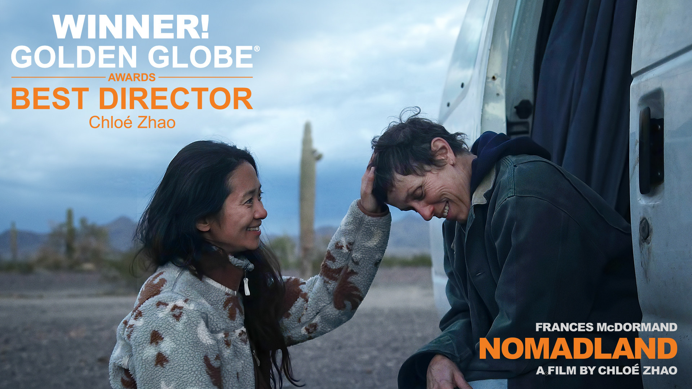

# S4 E8 低糖奥斯卡和它引发的辛辣争议

<figure>
    <figcaption></figcaption>
    <audio
        controls
        src="./audio.mp3">
            Your browser does not support the
            <code>audio</code> element.
    </audio>
</figure>

这期节目，我们和老朋友Elieen Chow一起聊了聊刚刚落幕的奥斯卡颁奖典礼。虽然典礼本身收视率历史新低，观众也情绪低迷，却产生了不少引发跨越墙内外的讨论的文化瞬间。
我们讨论了：

<ul>
<li>1:20 奥斯卡情绪低迷</li>
<li>7:50 赵婷的《无依之地》领奖宣言</li>
<li><a href="https://loudmurmursfm.com/feed/audio.xml#t=15:00">15:00</a> 引用三字经引发的争议</li>
<li><a href="https://loudmurmursfm.com/feed/audio.xml#t=30:10">30:10</a> 快评 - 最佳男主角《困在时间里的父亲》</li>
<li><a href="https://loudmurmursfm.com/feed/audio.xml#t=34:31">34:31</a> 快评 - 最佳男配角《犹大与黑弥赛亚》</li>
<li><a href="https://loudmurmursfm.com/feed/audio.xml#t=37:10">37:10</a> 快评 - 最佳剪辑和最佳音效《金属之声》</li>
<li><a href="https://loudmurmursfm.com/feed/audio.xml#t=39:39">39:39</a> 快评 - 最佳动画提名《狼行者》</li>
<li><a href="https://loudmurmursfm.com/feed/audio.xml#t=41:28">41:28</a> 快评 - 最佳纪录片提名《残疾营地》</li>
<li><a href="https://loudmurmursfm.com/feed/audio.xml#t=48:50">48:50</a> 最佳女配角和毒舌的尹汝贞</li>
</ul>

感谢大家收听本期节目，也可以在iTunes, Google Play, Spotify, CastBox等各大平台上找到我们。我们期待你的留言！

<ul>
<li>RSS feed: <a href="https://loudmurmursfm.typlog.io/episodes/feed.xml">https://loudmurmursfm.typlog.io/episodes/feed.xml</a></li>
<li>Itunes: <a href="https://apple.co/2rzhtXV">https://apple.co/2rzhtXV</a></li>
<li>Google play: goo.gl/KjRYPN</li>
<li>Spotify: <a href="https://spoti.fi/2IWNuRB">https://spoti.fi/2IWNuRB</a></li>
<li>Pocket Cast: <a href="http://pca.st/nLid">http://pca.st/nLid</a></li>
<li>Overcast: <a href="https://bit.ly/2SL7MNJ">https://bit.ly/2SL7MNJ</a></li>
</ul>

如果您喜欢我们的节目，欢迎通过爱发电支持我们：

<ul>
<li><a href="https://afdian.net/p/e0a54e82ebd111e9bd2d52540025c377">https://afdian.net/p/e0a54e82ebd111e9bd2d52540025c377</a></li>
</ul>

