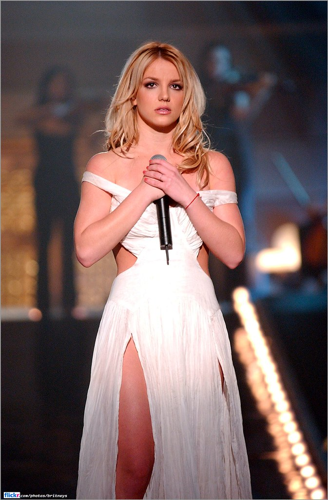

# S4 E18 被囚禁和被解放的小甜甜布兰妮

<figure>
    <figcaption></figcaption>
    <audio
        controls
        src="./audio.mp3">
            Your browser does not support the
            <code>audio</code> element.
    </audio>
</figure>

【聊了什么】

2021年8月13日，“小甜甜”布兰妮·斯皮尔斯的父亲杰米·斯皮尔斯宣布放弃监护权（Conservatorship），引发海内外网络上的热议。许多人无法理解的是，布兰妮在被“监护”的这十三年里，发了四张专辑，开过一场全球演唱会，在拉斯维加斯驻唱四年。在这个过程中，她的事业和身体都不受她自己控制；在监护人父亲的控制下，她被迫表演、工作，还不被允许取出身体中的避孕装置。
所以为什么，一个天才少女、舞台女王，全世界知名的巨星，在众目睽睽之下陨落，居然成了一段法律监护中的囚鸟？这两年来轰轰烈烈的“解放布兰妮“运动是怎么形成的？在这个节骨眼上，我们该如何反思千禧年前后的流行文化和我们如今的网络世界？

【直入内容】

<ul>
<li><a href="https://loudmurmursfm.com/feed/audio.xml#t=02:00">02:00</a> - 介绍《陷害布兰妮》和《布兰妮斯皮尔斯的保育权噩梦》——是什么样的合法监狱囚禁了世界级流行歌星？</li>
<li><a href="https://loudmurmursfm.com/feed/audio.xml#t=06:50">06:50</a> - 小甜甜布兰妮对我们——在中国长大的千禧一代意味着什么？</li>
<li><a href="https://loudmurmursfm.com/feed/audio.xml#t=13:50">13:50</a> - 从小到大我们如何对待公共视野中的少女？</li>
<li><a href="https://loudmurmursfm.com/feed/audio.xml#t=14:30">14:30</a> - 布兰妮如何从小镇女孩变成国际明星</li>
<li><a href="https://loudmurmursfm.com/feed/audio.xml#t=19:00">19:00</a> - 美国社会在 1990 年代末和 2000 年代初如何谈论性</li>
<li><a href="https://loudmurmursfm.com/feed/audio.xml#t=21:40">21:40</a> - Justin Timberlake 和 Britney Spears的恋爱关系以及全盛时期的八卦小报</li>
<li><a href="https://loudmurmursfm.com/feed/audio.xml#t=26:00">26:00</a> - 经历一段不幸婚姻，在全世界注视下初为人母的布兰妮</li>
<li><a href="https://loudmurmursfm.com/feed/audio.xml#t=29:00">29:00</a> - 布兰妮为什么“疯了”？</li>
<li><a href="https://loudmurmursfm.com/feed/audio.xml#t=32:20">32:20</a> - 布兰妮如何被判定进入保育系统？</li>
<li><a href="https://loudmurmursfm.com/feed/audio.xml#t=39:00">39:00</a> - 为什么布兰妮无法从保育系统中突围？</li>
<li><a href="https://loudmurmursfm.com/feed/audio.xml#t=41:00">41:00</a> - #FreeBritney运动背后的窥私欲和赎罪心态催生了一场完美的社交媒体集体道德狂欢</li>
<li><a href="https://loudmurmursfm.com/feed/audio.xml#t=47:00">47:00</a> - 解放了布兰妮，我们在大众舆论的“全景监狱”中还关押了多少年轻女性？</li>
<li><a href="https://loudmurmursfm.com/feed/audio.xml#t=54:00">54:00</a> - 为什么这么多名人少女在公众无所不在的注视下无法顺利成长为女性</li>
</ul>

【剪辑老师】

Joshua Ogden-Davis

【股东是你】

如果您喜欢我们的节目，欢迎通过爱发电或者Patreon支持我们，所有支持过我们的小声喧哗精神股东都会被邀请进入独家听众群，和主播们成为姐妹，天天闲聊：

点这里进入小声喧哗的爱发电页面：

<ul>
<li><a href="https://afdian.net/p/e0a54e82ebd111e9bd2d52540025c377">https://afdian.net/p/e0a54e82ebd111e9bd2d52540025c377</a></li>
</ul>

点这里进入小声喧哗的Patreon页面：

<ul>
<li><a href="https://www.patreon.com/loudmurmurs">https://www.patreon.com/loudmurmurs</a></li>
</ul>

【喧哗恰饭】

如果想要和小声喧哗进行商务合作，请发email到loudmurmursfm@gmail.com
或者添加微信号dowson1912

【如何收听】

你可以在iTunes, Google Play, Spotify, CastBox等各大平台上找到我们。我们期待你的留言！

<ul>
<li>RSS feed: <a href="https://loudmurmursfm.typlog.io/episodes/feed.xml">https://loudmurmursfm.typlog.io/episodes/feed.xml</a></li>
<li>Itunes: <a href="https://apple.co/2rzhtXV">https://apple.co/2rzhtXV</a></li>
<li>Google play: goo.gl/KjRYPN</li>
<li>Spotify: <a href="https://spoti.fi/2IWNuRB">https://spoti.fi/2IWNuRB</a></li>
<li>Pocket Cast: <a href="http://pca.st/nLid">http://pca.st/nLid</a></li>
<li>Overcast: <a href="https://bit.ly/2SL7MNJ">https://bit.ly/2SL7MNJ</a></li>
</ul>

<figure></figure>

