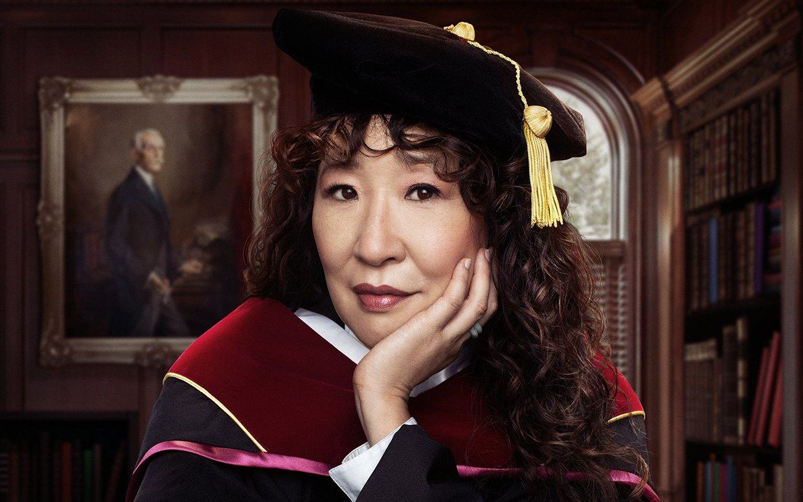

# S4 E20 「英文系主任」的写实和荒诞：兵荒马乱中的亚裔女教授们

<figure>
    <figcaption></figcaption>
    <audio
        controls
        src="./audio.mp3">
            Your browser does not support the
            <code>audio</code> element.
    </audio>
</figure>

【聊了什么】

我们找了两位身处美国高等学院漩涡的女性“英文系主任”来聊聊最近大家都在看的这部Netflix剧集。言论自由、左翼运动、女性教授的联盟和解体在美国大学究竟是什么样？面对激进Gen-z的困惑。如何边带娃边教书？如何在充满白人男性的房间中，找到自己在那个空间存在的合法性？Yuan Yuan和Eileen这两位女性学者都给了这期节目最真实的回答。

【直入内容】

<ul>
<li>
<a href="https://loudmurmursfm.com/feed/audio.xml#t=02:00">02:00</a> 这部剧集讲了一个怎样的故事？

</li>
<li>
<a href="https://loudmurmursfm.com/feed/audio.xml#t=03:40">03:40</a> 作为一个有三个孩子在美国大学教书的亚裔女教授，Eileen的直观感受是什么？

</li>
<li>
<a href="https://loudmurmursfm.com/feed/audio.xml#t=06:20">06:20</a> 短短六集，却想说清楚美国高等院校最激烈的冲突

</li>
<li>
<a href="https://loudmurmursfm.com/feed/audio.xml#t=10:30">10:30</a> 剧情呈现的短板——粗暴简化学生的动机，给黑人女教授设置了童话般不合常理结局

</li>
<li>
<a href="https://loudmurmursfm.com/feed/audio.xml#t=13:20">13:20</a> 作为女教授，你认为剧中的世界和真实的学院差多远？为什么说里面的一些问题更像是20年前的情况？

</li>
<li>
<a href="https://loudmurmursfm.com/feed/audio.xml#t=17:03">17:03</a> 耶鲁的哲学系的情况，更像是剧中的英文系

</li>
<li>
<a href="https://loudmurmursfm.com/feed/audio.xml#t=18:30">18:30</a> 看到片中那些老白男们，PTSD卷土重来

</li>
<li>
<a href="https://loudmurmursfm.com/feed/audio.xml#t=24:45">24:45</a> Bill, 全篇最真实的人物？游离在体制外，不断甩锅给别人，不断让人兜底，但又获得了所有人的宽容

</li>
<li>
<a href="https://loudmurmursfm.com/feed/audio.xml#t=29:05">29:05</a> 观众乐意看到一个白人男性出丑，但我们却要求Ji-yoon完美

</li>
<li>
<a href="https://loudmurmursfm.com/feed/audio.xml#t=30:45">30:45</a> 谈谈Ji-yoon这个角色

</li>
<li>
<a href="https://loudmurmursfm.com/feed/audio.xml#t=34:30">34:30</a> Ji-yoon和Bill之间的冲突和亲密

</li>
<li>
<a href="https://loudmurmursfm.com/feed/audio.xml#t=39:40">39:40</a> 大学中女性教授之间的盟友关系

</li>
<li>
<a href="https://loudmurmursfm.com/feed/audio.xml#t=41:50">41:50</a> Joan这个角色的矛盾，以及美国校园代际的政治光谱如何流动？

</li>
<li>
<a href="https://loudmurmursfm.com/feed/audio.xml#t=48:20">48:20</a> 对学生不公正的呈现

</li>
<li>
<a href="https://loudmurmursfm.com/feed/audio.xml#t=56:25">56:25</a> 剧中的年龄歧视，嘲讽老年人身体上的尴尬

</li>
<li>
<a href="https://loudmurmursfm.com/feed/audio.xml#t=1:01:10">1:01:10</a> 一个不太被讨论的力量：学校的管理层

</li>
</ul>

【哪位主播】

Afra

娟

【嘉宾是谁】

Yuan Yuan: 美国耶鲁大学哲学PhD, 现在在NYU-Shanghai任教

Eileen：周成荫，小声喧哗的好姐妹，在美国杜克大学任教，任世新大學舍我纪念馆馆长. Twitter @chowleen

【剪辑老师】

Joshua

【股东是你】

如果您喜欢我们的节目，欢迎通过爱发电或者Patreon支持我们，所有支持过我们的小声喧哗精神股东都会被邀请进入独家听众群，和主播们成为姐妹，天天闲聊：

点这里进入小声喧哗的爱发电页面：
<a href="https://afdian.net/p/e0a54e82ebd111e9bd2d52540025c377">https://afdian.net/p/e0a54e82ebd111e9bd2d52540025c377</a>

点这里进入小声喧哗的Patreon页面：
<a href="https://www.patreon.com/loudmurmurs">https://www.patreon.com/loudmurmurs</a>

【作品外链】

1619 Project
<a href="https://www.nytimes.com/interactive/2019/08/14/magazine/1619-america-slavery.html">https://www.nytimes.com/interactive/2019/08/14/magazine/1619-america-slavery.html</a>

【喧哗恰饭】

如果想要和小声喧哗进行商务合作，请发email到loudmurmursfm@gmail.com
或者添加微信号dowson1912

【如何收听】

你可以在iTunes, Google Play, Spotify, CastBox等各大平台上找到我们。我们期待你的留言！

RSS feed: <a href="https://loudmurmursfm.typlog.io/episodes/feed.xml">https://loudmurmursfm.typlog.io/episodes/feed.xml</a>

Itunes: <a href="https://apple.co/2rzhtXV">https://apple.co/2rzhtXV</a>

Google play: goo.gl/KjRYPN

Spotify: <a href="https://spoti.fi/2IWNuRB">https://spoti.fi/2IWNuRB</a>

Pocket Cast: <a href="http://pca.st/nLid">http://pca.st/nLid</a>

Overcast: <a href="https://bit.ly/2SL7MNJ">https://bit.ly/2SL7MNJ</a>

